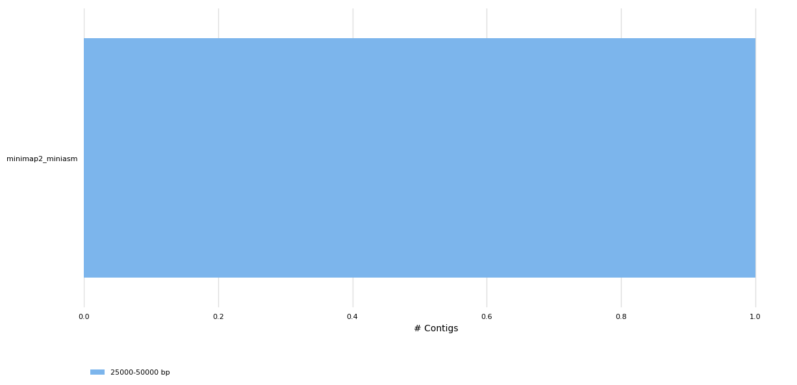
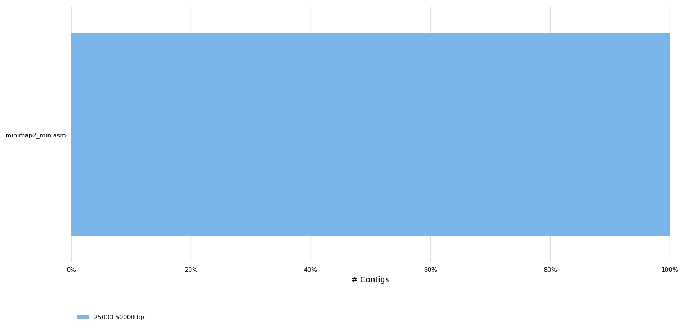
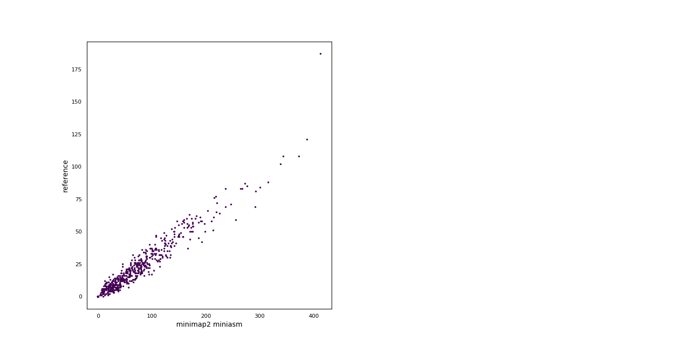

# Assembler benchmark for ONT MinION data
#### Authors: B. Honeydew
Generated using [poreTally](https://github.com/cvdelannoy/poreTally), a benchmarking tool. For an interactive version of this report, download REPORT.html from this repository.

<h2>Abstract</h2>The MinION is a portable DNA sequencer that generates long error-prone reads. As both the hardware and analysis software are updated regularly, the most suitable pipeline for subsequent analyses of a dataset generated with a given combination of hardware and software for a given organism is not always clear. Here we present a benchmark for a selection of <i>de novo</i> assemblers available to MinION users, on a read set of <i>Homo sapiens</i> (NCBI taxID: 9606). This benchmark is based on a <a href=\>benchmarking routine</a>, designed to facilitate easy replication on a read set of choice and addition of other <i>de novo</i> assembly pipelines.<h2>Methods</h2><h3>Readset quality assessment</h3>Reads in this dataset were generated on a Minion with FLO-MIN106 flowcell with SQK-LSK108 kit. The reads were basecalled using Albacore 2.2.7. Prior to assembly, the quality of the untreated readset was analysed using NanoPlot (version: 1.13.0) and mapped using the mappy module (version: 2.1) in Python3.<h3>Assembly pipelines</h3><h4>minimap2 miniasm</h4>Minimap2 is a fast all-vs-all mapper of reads that relies on sketches of sequences, composed of minimizers. Miniasm uses the found overlaps to construct an assembly graph. As a consensus step is lacking in this pipeline, post-assembly polishing is often required. &zwnj; &zwnj;<b>Included tools:</b><ul><li>miniasm (version: 0.2-r128) </li><li>minimap2 (version: 2.10-r761) </li></ul> &zwnj;<b>Used command:</b><pre><code>minimap2 -x ava-ont -t 4 {input.fastq} {input.fastq} | gzip -1 > minimap2.paf.gz
miniasm -f {input.fastq} minimap2.paf.gz > minimap2_miniasm.gfa
grep -Po '(?<=S\t).+(?=\[M::main\])' minimap2_miniasm.gfa | awk '{{print ">"$1"\\n"$2}}' | fold > {output}
</code></pre><h3>Assembly quality assessment</h3>Produced assemblies were analyzed and compared on continuity and agreement with the reference genome. Quast (version: 4.6.3) was used to determine a wide array of quality metrics in both quality categories and produce synteny plots. To elucidate any bias in the occurence of certain sequences, 5-mers in the assemblies and the reference genomes were compared using Jellyfish (version: 2.2.6). Finally, results were summarized using MultiQC.<h2>Results</h2><h3>General Statistics</h3><table>
<thead>
<tr><th style="text-align: center;">                </th><th style="text-align: center;"> mean CPU load MB </th><th style="text-align: center;"> CPU time </th><th style="text-align: center;"> N50 </th><th style="text-align: center;"> Total length </th></tr>
</thead>
<tbody>
<tr><td style="text-align: center;">minimap2_miniasm</td><td style="text-align: center;">        0         </td><td style="text-align: center;"> 0:00:00  </td><td style="text-align: center;">40947</td><td style="text-align: center;">    40947     </td></tr>
</tbody>
</table><h3>Readset quality</h3>
<table>
<thead>
<tr><th style="text-align: center;">                          </th><th style="text-align: center;"> Value </th><th style="text-align: center;">                 </th><th style="text-align: center;">  N   </th><th style="text-align: center;">  %  </th></tr>
</thead>
<tbody>
<tr><td style="text-align: center;"> <b>Mean read quality</b> </td><td style="text-align: center;">  9.1  </td><td style="text-align: center;"><b>deletions</b> </td><td style="text-align: center;">11982 </td><td style="text-align: center;">6.03 </td></tr>
<tr><td style="text-align: center;"><b>Median read quality</b></td><td style="text-align: center;">  9.4  </td><td style="text-align: center;"><b>insertions</b></td><td style="text-align: center;"> 8100 </td><td style="text-align: center;">4.08 </td></tr>
<tr><td style="text-align: center;"><b>Median read length</b> </td><td style="text-align: center;"> 14488 </td><td style="text-align: center;"> <b>matches</b>  </td><td style="text-align: center;">167884</td><td style="text-align: center;">84.56</td></tr>
<tr><td style="text-align: center;"> <b>Mean read length</b>  </td><td style="text-align: center;">15401.7</td><td style="text-align: center;"><b>mismatches</b></td><td style="text-align: center;">10580 </td><td style="text-align: center;">5.33 </td></tr>
</tbody>
</table><h3>QUAST</h3><h4>Assembly Statistics</h4><table>
<thead>
<tr><th style="text-align: center;">                </th><th style="text-align: center;"> L75 (K) </th><th style="text-align: center;"> N50 (Kbp) </th><th style="text-align: center;"> L50 (K) </th><th style="text-align: center;"> Largest contig (Kbp) </th><th style="text-align: center;"> N75 (Kbp) </th><th style="text-align: center;"> Length (Mbp) </th></tr>
</thead>
<tbody>
<tr><td style="text-align: center;">minimap2_miniasm</td><td style="text-align: center;">    1    </td><td style="text-align: center;">   40947   </td><td style="text-align: center;">    1    </td><td style="text-align: center;">        40947         </td><td style="text-align: center;">   40947   </td><td style="text-align: center;">    40947     </td></tr>
</tbody>
</table><h4>Number of Contigs</h4>

<h3> <i>k</i>-mer Counts</h3>

<h3> Synteny Plots</h3>

<h3>CPU usage</h3>

CPU usage was monitored during runs using the psutil package in Python3. Reported here are CPU time and memory usage(proportional and unique set size, PSS and USS respectively).<table>
<thead>
<tr><th style="text-align: center;"> CPU time </th><th style="text-align: center;"> I/O in (MB/s) </th><th style="text-align: center;"> I/O out (MB/s) </th><th style="text-align: center;"> mean load (MB) </th><th style="text-align: center;"> peak PSS (MB) </th><th style="text-align: center;"> peak USS (MB) </th></tr>
</thead>
<tbody>
<tr><td style="text-align: center;"> 0:00:00  </td><td style="text-align: center;">       0       </td><td style="text-align: center;">       0        </td><td style="text-align: center;">       0        </td><td style="text-align: center;">     0.46      </td><td style="text-align: center;">     0.13      </td></tr>
</tbody>
</table>