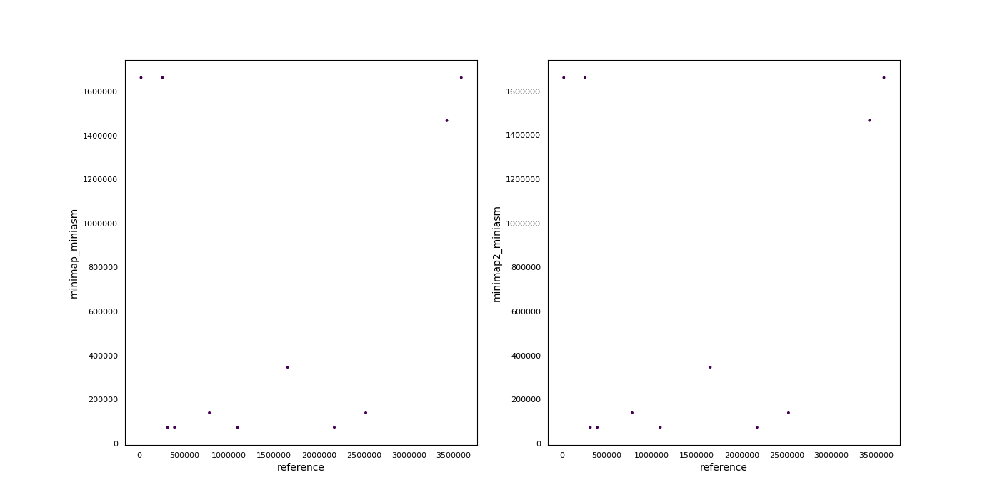

<!DOCTYPE html>
<html lang="en">
<head>

  

<meta charset="utf-8">
<meta http-equiv="X-UA-Compatible" content="IE=edge">
<meta name="viewport" content="width=device-width, initial-scale=1">

<meta name="description" content="MultiQC: A modular tool to aggregate results from bioinformatics analyses across many samples into a single report">
<meta name="author" content="MultiQC">
<title>Assembler Benchmark report: MultiQC Report</title>

<!-- JSON plot data -->

  

<!-- Include CSS -->
<style type="text/css">/*!
 * Bootstrap v3.3.7 (http://getbootstrap.com)
 * Copyright 2011-2016 Twitter, Inc.
 * Licensed under MIT (https://github.com/twbs/bootstrap/blob/master/LICENSE)
 *//*! normalize.css v3.0.3 | MIT License | github.com/necolas/normalize.css */html{font-family:sans-serif;-webkit-text-size-adjust:100%;-ms-text-size-adjust:100%}body{margin:0}article,aside,details,figcaption,figure,footer,header,hgroup,main,menu,nav,section,summary{display:block}audio,canvas,progress,video{display:inline-block;vertical-align:baseline}audio:not([controls]){display:none;height:0}[hidden],template{display:none}a{background-color:transparent}a:active,a:hover{outline:0}abbr[title]{border-bottom:1px dotted}b,strong{font-weight:700}dfn{font-style:italic}h1{margin:.67em 0;font-size:2em}mark{color:#000;background:#ff0}small{font-size:80%}sub,sup{position:relative;font-size:75%;line-height:0;vertical-align:baseline}sup{top:-.5em}sub{bottom:-.25em}img{border:0}svg:not(:root){overflow:hidden}figure{margin:1em 40px}hr{height:0;-webkit-box-sizing:content-box;-moz-box-sizing:content-box;box-sizing:content-box}pre{overflow:auto}code,kbd,pre,samp{font-family:monospace,monospace;font-size:1em}button,input,optgroup,select,textarea{margin:0;font:inherit;color:inherit}button{overflow:visible}button,select{text-transform:none}button,html input[type=button],input[type=reset],input[type=submit]{-webkit-appearance:button;cursor:pointer}button[disabled],html input[disabled]{cursor:default}button::-moz-focus-inner,input::-moz-focus-inner{padding:0;border:0}input{line-height:normal}input[type=checkbox],input[type=radio]{-webkit-box-sizing:border-box;-moz-box-sizing:border-box;box-sizing:border-box;padding:0}input[type=number]::-webkit-inner-spin-button,input[type=number]::-webkit-outer-spin-button{height:auto}input[type=search]{-webkit-box-sizing:content-box;-moz-box-sizing:content-box;box-sizing:content-box;-webkit-appearance:textfield}input[type=search]::-webkit-search-cancel-button,input[type=search]::-webkit-search-decoration{-webkit-appearance:none}fieldset{padding:.35em .625em .75em;margin:0 2px;border:1px solid silver}legend{padding:0;border:0}textarea{overflow:auto}optgroup{font-weight:700}table{border-spacing:0;border-collapse:collapse}td,th{padding:0}/*! Source: https://github.com/h5bp/html5-boilerplate/blob/master/src/css/main.css */@media print{*,:after,:before{color:#000!important;text-shadow:none!important;background:0 0!important;-webkit-box-shadow:none!important;box-shadow:none!important}a,a:visited{text-decoration:underline}a[href]:after{content:" (" attr(href) ")"}abbr[title]:after{content:" (" attr(title) ")"}a[href^="javascript:"]:after,a[href^="#"]:after{content:""}blockquote,pre{border:1px solid #999;page-break-inside:avoid}thead{display:table-header-group}img,tr{page-break-inside:avoid}img{max-width:100%!important}h2,h3,p{orphans:3;widows:3}h2,h3{page-break-after:avoid}.navbar{display:none}.btn>.caret,.dropup>.btn>.caret{border-top-color:#000!important}.label{border:1px solid #000}.table{border-collapse:collapse!important}.table td,.table th{background-color:#fff!important}.table-bordered td,.table-bordered th{border:1px solid #ddd!important}}.glyphicon{position:relative;top:1px;display:inline-block;font-family:'Glyphicons Halflings';font-style:normal;font-weight:400;line-height:1;-webkit-font-smoothing:antialiased;-moz-osx-font-smoothing:grayscale}.glyphicon-asterisk:before{content:"\002a"}.glyphicon-plus:before{content:"\002b"}.glyphicon-eur:before,.glyphicon-euro:before{content:"\20ac"}.glyphicon-minus:before{content:"\2212"}.glyphicon-cloud:before{content:"\2601"}.glyphicon-envelope:before{content:"\2709"}.glyphicon-pencil:before{content:"\270f"}.glyphicon-glass:before{content:"\e001"}.glyphicon-music:before{content:"\e002"}.glyphicon-search:before{content:"\e003"}.glyphicon-heart:before{content:"\e005"}.glyphicon-star:before{content:"\e006"}.glyphicon-star-empty:before{content:"\e007"}.glyphicon-user:before{content:"\e008"}.glyphicon-film:before{content:"\e009"}.glyphicon-th-large:before{content:"\e010"}.glyphicon-th:before{content:"\e011"}.glyphicon-th-list:before{content:"\e012"}.glyphicon-ok:before{content:"\e013"}.glyphicon-remove:before{content:"\e014"}.glyphicon-zoom-in:before{content:"\e015"}.glyphicon-zoom-out:before{content:"\e016"}.glyphicon-off:before{content:"\e017"}.glyphicon-signal:before{content:"\e018"}.glyphicon-cog:before{content:"\e019"}.glyphicon-trash:before{content:"\e020"}.glyphicon-home:before{content:"\e021"}.glyphicon-file:before{content:"\e022"}.glyphicon-time:before{content:"\e023"}.glyphicon-road:before{content:"\e024"}.glyphicon-download-alt:before{content:"\e025"}.glyphicon-download:before{content:"\e026"}.glyphicon-upload:before{content:"\e027"}.glyphicon-inbox:before{content:"\e028"}.glyphicon-play-circle:before{content:"\e029"}.glyphicon-repeat:before{content:"\e030"}.glyphicon-refresh:before{content:"\e031"}.glyphicon-list-alt:before{content:"\e032"}.glyphicon-lock:before{content:"\e033"}.glyphicon-flag:before{content:"\e034"}.glyphicon-headphones:before{content:"\e035"}.glyphicon-volume-off:before{content:"\e036"}.glyphicon-volume-down:before{content:"\e037"}.glyphicon-volume-up:before{content:"\e038"}.glyphicon-qrcode:before{content:"\e039"}.glyphicon-barcode:before{content:"\e040"}.glyphicon-tag:before{content:"\e041"}.glyphicon-tags:before{content:"\e042"}.glyphicon-book:before{content:"\e043"}.glyphicon-bookmark:before{content:"\e044"}.glyphicon-print:before{content:"\e045"}.glyphicon-camera:before{content:"\e046"}.glyphicon-font:before{content:"\e047"}.glyphicon-bold:before{content:"\e048"}.glyphicon-italic:before{content:"\e049"}.glyphicon-text-height:before{content:"\e050"}.glyphicon-text-width:before{content:"\e051"}.glyphicon-align-left:before{content:"\e052"}.glyphicon-align-center:before{content:"\e053"}.glyphicon-align-right:before{content:"\e054"}.glyphicon-align-justify:before{content:"\e055"}.glyphicon-list:before{content:"\e056"}.glyphicon-indent-left:before{content:"\e057"}.glyphicon-indent-right:before{content:"\e058"}.glyphicon-facetime-video:before{content:"\e059"}.glyphicon-picture:before{content:"\e060"}.glyphicon-map-marker:before{content:"\e062"}.glyphicon-adjust:before{content:"\e063"}.glyphicon-tint:before{content:"\e064"}.glyphicon-edit:before{content:"\e065"}.glyphicon-share:before{content:"\e066"}.glyphicon-check:before{content:"\e067"}.glyphicon-move:before{content:"\e068"}.glyphicon-step-backward:before{content:"\e069"}.glyphicon-fast-backward:before{content:"\e070"}.glyphicon-backward:before{content:"\e071"}.glyphicon-play:before{content:"\e072"}.glyphicon-pause:before{content:"\e073"}.glyphicon-stop:before{content:"\e074"}.glyphicon-forward:before{content:"\e075"}.glyphicon-fast-forward:before{content:"\e076"}.glyphicon-step-forward:before{content:"\e077"}.glyphicon-eject:before{content:"\e078"}.glyphicon-chevron-left:before{content:"\e079"}.glyphicon-chevron-right:before{content:"\e080"}.glyphicon-plus-sign:before{content:"\e081"}.glyphicon-minus-sign:before{content:"\e082"}.glyphicon-remove-sign:before{content:"\e083"}.glyphicon-ok-sign:before{content:"\e084"}.glyphicon-question-sign:before{content:"\e085"}.glyphicon-info-sign:before{content:"\e086"}.glyphicon-screenshot:before{content:"\e087"}.glyphicon-remove-circle:before{content:"\e088"}.glyphicon-ok-circle:before{content:"\e089"}.glyphicon-ban-circle:before{content:"\e090"}.glyphicon-arrow-left:before{content:"\e091"}.glyphicon-arrow-right:before{content:"\e092"}.glyphicon-arrow-up:before{content:"\e093"}.glyphicon-arrow-down:before{content:"\e094"}.glyphicon-share-alt:before{content:"\e095"}.glyphicon-resize-full:before{content:"\e096"}.glyphicon-resize-small:before{content:"\e097"}.glyphicon-exclamation-sign:before{content:"\e101"}.glyphicon-gift:before{content:"\e102"}.glyphicon-leaf:before{content:"\e103"}.glyphicon-fire:before{content:"\e104"}.glyphicon-eye-open:before{content:"\e105"}.glyphicon-eye-close:before{content:"\e106"}.glyphicon-warning-sign:before{content:"\e107"}.glyphicon-plane:before{content:"\e108"}.glyphicon-calendar:before{content:"\e109"}.glyphicon-random:before{content:"\e110"}.glyphicon-comment:before{content:"\e111"}.glyphicon-magnet:before{content:"\e112"}.glyphicon-chevron-up:before{content:"\e113"}.glyphicon-chevron-down:before{content:"\e114"}.glyphicon-retweet:before{content:"\e115"}.glyphicon-shopping-cart:before{content:"\e116"}.glyphicon-folder-close:before{content:"\e117"}.glyphicon-folder-open:before{content:"\e118"}.glyphicon-resize-vertical:before{content:"\e119"}.glyphicon-resize-horizontal:before{content:"\e120"}.glyphicon-hdd:before{content:"\e121"}.glyphicon-bullhorn:before{content:"\e122"}.glyphicon-bell:before{content:"\e123"}.glyphicon-certificate:before{content:"\e124"}.glyphicon-thumbs-up:before{content:"\e125"}.glyphicon-thumbs-down:before{content:"\e126"}.glyphicon-hand-right:before{content:"\e127"}.glyphicon-hand-left:before{content:"\e128"}.glyphicon-hand-up:before{content:"\e129"}.glyphicon-hand-down:before{content:"\e130"}.glyphicon-circle-arrow-right:before{content:"\e131"}.glyphicon-circle-arrow-left:before{content:"\e132"}.glyphicon-circle-arrow-up:before{content:"\e133"}.glyphicon-circle-arrow-down:before{content:"\e134"}.glyphicon-globe:before{content:"\e135"}.glyphicon-wrench:before{content:"\e136"}.glyphicon-tasks:before{content:"\e137"}.glyphicon-filter:before{content:"\e138"}.glyphicon-briefcase:before{content:"\e139"}.glyphicon-fullscreen:before{content:"\e140"}.glyphicon-dashboard:before{content:"\e141"}.glyphicon-paperclip:before{content:"\e142"}.glyphicon-heart-empty:before{content:"\e143"}.glyphicon-link:before{content:"\e144"}.glyphicon-phone:before{content:"\e145"}.glyphicon-pushpin:before{content:"\e146"}.glyphicon-usd:before{content:"\e148"}.glyphicon-gbp:before{content:"\e149"}.glyphicon-sort:before{content:"\e150"}.glyphicon-sort-by-alphabet:before{content:"\e151"}.glyphicon-sort-by-alphabet-alt:before{content:"\e152"}.glyphicon-sort-by-order:before{content:"\e153"}.glyphicon-sort-by-order-alt:before{content:"\e154"}.glyphicon-sort-by-attributes:before{content:"\e155"}.glyphicon-sort-by-attributes-alt:before{content:"\e156"}.glyphicon-unchecked:before{content:"\e157"}.glyphicon-expand:before{content:"\e158"}.glyphicon-collapse-down:before{content:"\e159"}.glyphicon-collapse-up:before{content:"\e160"}.glyphicon-log-in:before{content:"\e161"}.glyphicon-flash:before{content:"\e162"}.glyphicon-log-out:before{content:"\e163"}.glyphicon-new-window:before{content:"\e164"}.glyphicon-record:before{content:"\e165"}.glyphicon-save:before{content:"\e166"}.glyphicon-open:before{content:"\e167"}.glyphicon-saved:before{content:"\e168"}.glyphicon-import:before{content:"\e169"}.glyphicon-export:before{content:"\e170"}.glyphicon-send:before{content:"\e171"}.glyphicon-floppy-disk:before{content:"\e172"}.glyphicon-floppy-saved:before{content:"\e173"}.glyphicon-floppy-remove:before{content:"\e174"}.glyphicon-floppy-save:before{content:"\e175"}.glyphicon-floppy-open:before{content:"\e176"}.glyphicon-credit-card:before{content:"\e177"}.glyphicon-transfer:before{content:"\e178"}.glyphicon-cutlery:before{content:"\e179"}.glyphicon-header:before{content:"\e180"}.glyphicon-compressed:before{content:"\e181"}.glyphicon-earphone:before{content:"\e182"}.glyphicon-phone-alt:before{content:"\e183"}.glyphicon-tower:before{content:"\e184"}.glyphicon-stats:before{content:"\e185"}.glyphicon-sd-video:before{content:"\e186"}.glyphicon-hd-video:before{content:"\e187"}.glyphicon-subtitles:before{content:"\e188"}.glyphicon-sound-stereo:before{content:"\e189"}.glyphicon-sound-dolby:before{content:"\e190"}.glyphicon-sound-5-1:before{content:"\e191"}.glyphicon-sound-6-1:before{content:"\e192"}.glyphicon-sound-7-1:before{content:"\e193"}.glyphicon-copyright-mark:before{content:"\e194"}.glyphicon-registration-mark:before{content:"\e195"}.glyphicon-cloud-download:before{content:"\e197"}.glyphicon-cloud-upload:before{content:"\e198"}.glyphicon-tree-conifer:before{content:"\e199"}.glyphicon-tree-deciduous:before{content:"\e200"}.glyphicon-cd:before{content:"\e201"}.glyphicon-save-file:before{content:"\e202"}.glyphicon-open-file:before{content:"\e203"}.glyphicon-level-up:before{content:"\e204"}.glyphicon-copy:before{content:"\e205"}.glyphicon-paste:before{content:"\e206"}.glyphicon-alert:before{content:"\e209"}.glyphicon-equalizer:before{content:"\e210"}.glyphicon-king:before{content:"\e211"}.glyphicon-queen:before{content:"\e212"}.glyphicon-pawn:before{content:"\e213"}.glyphicon-bishop:before{content:"\e214"}.glyphicon-knight:before{content:"\e215"}.glyphicon-baby-formula:before{content:"\e216"}.glyphicon-tent:before{content:"\26fa"}.glyphicon-blackboard:before{content:"\e218"}.glyphicon-bed:before{content:"\e219"}.glyphicon-apple:before{content:"\f8ff"}.glyphicon-erase:before{content:"\e221"}.glyphicon-hourglass:before{content:"\231b"}.glyphicon-lamp:before{content:"\e223"}.glyphicon-duplicate:before{content:"\e224"}.glyphicon-piggy-bank:before{content:"\e225"}.glyphicon-scissors:before{content:"\e226"}.glyphicon-bitcoin:before{content:"\e227"}.glyphicon-btc:before{content:"\e227"}.glyphicon-xbt:before{content:"\e227"}.glyphicon-yen:before{content:"\00a5"}.glyphicon-jpy:before{content:"\00a5"}.glyphicon-ruble:before{content:"\20bd"}.glyphicon-rub:before{content:"\20bd"}.glyphicon-scale:before{content:"\e230"}.glyphicon-ice-lolly:before{content:"\e231"}.glyphicon-ice-lolly-tasted:before{content:"\e232"}.glyphicon-education:before{content:"\e233"}.glyphicon-option-horizontal:before{content:"\e234"}.glyphicon-option-vertical:before{content:"\e235"}.glyphicon-menu-hamburger:before{content:"\e236"}.glyphicon-modal-window:before{content:"\e237"}.glyphicon-oil:before{content:"\e238"}.glyphicon-grain:before{content:"\e239"}.glyphicon-sunglasses:before{content:"\e240"}.glyphicon-text-size:before{content:"\e241"}.glyphicon-text-color:before{content:"\e242"}.glyphicon-text-background:before{content:"\e243"}.glyphicon-object-align-top:before{content:"\e244"}.glyphicon-object-align-bottom:before{content:"\e245"}.glyphicon-object-align-horizontal:before{content:"\e246"}.glyphicon-object-align-left:before{content:"\e247"}.glyphicon-object-align-vertical:before{content:"\e248"}.glyphicon-object-align-right:before{content:"\e249"}.glyphicon-triangle-right:before{content:"\e250"}.glyphicon-triangle-left:before{content:"\e251"}.glyphicon-triangle-bottom:before{content:"\e252"}.glyphicon-triangle-top:before{content:"\e253"}.glyphicon-console:before{content:"\e254"}.glyphicon-superscript:before{content:"\e255"}.glyphicon-subscript:before{content:"\e256"}.glyphicon-menu-left:before{content:"\e257"}.glyphicon-menu-right:before{content:"\e258"}.glyphicon-menu-down:before{content:"\e259"}.glyphicon-menu-up:before{content:"\e260"}*{-webkit-box-sizing:border-box;-moz-box-sizing:border-box;box-sizing:border-box}:after,:before{-webkit-box-sizing:border-box;-moz-box-sizing:border-box;box-sizing:border-box}html{font-size:10px;-webkit-tap-highlight-color:rgba(0,0,0,0)}body{font-family:"Helvetica Neue",Helvetica,Arial,sans-serif;font-size:14px;line-height:1.42857143;color:#333;background-color:#fff}button,input,select,textarea{font-family:inherit;font-size:inherit;line-height:inherit}a{color:#337ab7;text-decoration:none}a:focus,a:hover{color:#23527c;text-decoration:underline}a:focus{outline:5px auto -webkit-focus-ring-color;outline-offset:-2px}figure{margin:0}img{vertical-align:middle}.carousel-inner>.item>a>img,.carousel-inner>.item>img,.img-responsive,.thumbnail a>img,.thumbnail>img{display:block;max-width:100%;height:auto}.img-rounded{border-radius:6px}.img-thumbnail{display:inline-block;max-width:100%;height:auto;padding:4px;line-height:1.42857143;background-color:#fff;border:1px solid #ddd;border-radius:4px;-webkit-transition:all .2s ease-in-out;-o-transition:all .2s ease-in-out;transition:all .2s ease-in-out}.img-circle{border-radius:50%}hr{margin-top:20px;margin-bottom:20px;border:0;border-top:1px solid #eee}.sr-only{position:absolute;width:1px;height:1px;padding:0;margin:-1px;overflow:hidden;clip:rect(0,0,0,0);border:0}.sr-only-focusable:active,.sr-only-focusable:focus{position:static;width:auto;height:auto;margin:0;overflow:visible;clip:auto}[role=button]{cursor:pointer}.h1,.h2,.h3,.h4,.h5,.h6,h1,h2,h3,h4,h5,h6{font-family:inherit;font-weight:500;line-height:1.1;color:inherit}.h1 .small,.h1 small,.h2 .small,.h2 small,.h3 .small,.h3 small,.h4 .small,.h4 small,.h5 .small,.h5 small,.h6 .small,.h6 small,h1 .small,h1 small,h2 .small,h2 small,h3 .small,h3 small,h4 .small,h4 small,h5 .small,h5 small,h6 .small,h6 small{font-weight:400;line-height:1;color:#777}.h1,.h2,.h3,h1,h2,h3{margin-top:20px;margin-bottom:10px}.h1 .small,.h1 small,.h2 .small,.h2 small,.h3 .small,.h3 small,h1 .small,h1 small,h2 .small,h2 small,h3 .small,h3 small{font-size:65%}.h4,.h5,.h6,h4,h5,h6{margin-top:10px;margin-bottom:10px}.h4 .small,.h4 small,.h5 .small,.h5 small,.h6 .small,.h6 small,h4 .small,h4 small,h5 .small,h5 small,h6 .small,h6 small{font-size:75%}.h1,h1{font-size:36px}.h2,h2{font-size:30px}.h3,h3{font-size:24px}.h4,h4{font-size:18px}.h5,h5{font-size:14px}.h6,h6{font-size:12px}p{margin:0 0 10px}.lead{margin-bottom:20px;font-size:16px;font-weight:300;line-height:1.4}@media (min-width:768px){.lead{font-size:21px}}.small,small{font-size:85%}.mark,mark{padding:.2em;background-color:#fcf8e3}.text-left{text-align:left}.text-right{text-align:right}.text-center{text-align:center}.text-justify{text-align:justify}.text-nowrap{white-space:nowrap}.text-lowercase{text-transform:lowercase}.text-uppercase{text-transform:uppercase}.text-capitalize{text-transform:capitalize}.text-muted{color:#777}.text-primary{color:#337ab7}a.text-primary:focus,a.text-primary:hover{color:#286090}.text-success{color:#3c763d}a.text-success:focus,a.text-success:hover{color:#2b542c}.text-info{color:#31708f}a.text-info:focus,a.text-info:hover{color:#245269}.text-warning{color:#8a6d3b}a.text-warning:focus,a.text-warning:hover{color:#66512c}.text-danger{color:#a94442}a.text-danger:focus,a.text-danger:hover{color:#843534}.bg-primary{color:#fff;background-color:#337ab7}a.bg-primary:focus,a.bg-primary:hover{background-color:#286090}.bg-success{background-color:#dff0d8}a.bg-success:focus,a.bg-success:hover{background-color:#c1e2b3}.bg-info{background-color:#d9edf7}a.bg-info:focus,a.bg-info:hover{background-color:#afd9ee}.bg-warning{background-color:#fcf8e3}a.bg-warning:focus,a.bg-warning:hover{background-color:#f7ecb5}.bg-danger{background-color:#f2dede}a.bg-danger:focus,a.bg-danger:hover{background-color:#e4b9b9}.page-header{padding-bottom:9px;margin:40px 0 20px;border-bottom:1px solid #eee}ol,ul{margin-top:0;margin-bottom:10px}ol ol,ol ul,ul ol,ul ul{margin-bottom:0}.list-unstyled{padding-left:0;list-style:none}.list-inline{padding-left:0;margin-left:-5px;list-style:none}.list-inline>li{display:inline-block;padding-right:5px;padding-left:5px}dl{margin-top:0;margin-bottom:20px}dd,dt{line-height:1.42857143}dt{font-weight:700}dd{margin-left:0}@media (min-width:768px){.dl-horizontal dt{float:left;width:160px;overflow:hidden;clear:left;text-align:right;text-overflow:ellipsis;white-space:nowrap}.dl-horizontal dd{margin-left:180px}}abbr[data-original-title],abbr[title]{cursor:help;border-bottom:1px dotted #777}.initialism{font-size:90%;text-transform:uppercase}blockquote{padding:10px 20px;margin:0 0 20px;font-size:17.5px;border-left:5px solid #eee}blockquote ol:last-child,blockquote p:last-child,blockquote ul:last-child{margin-bottom:0}blockquote .small,blockquote footer,blockquote small{display:block;font-size:80%;line-height:1.42857143;color:#777}blockquote .small:before,blockquote footer:before,blockquote small:before{content:'\2014 \00A0'}.blockquote-reverse,blockquote.pull-right{padding-right:15px;padding-left:0;text-align:right;border-right:5px solid #eee;border-left:0}.blockquote-reverse .small:before,.blockquote-reverse footer:before,.blockquote-reverse small:before,blockquote.pull-right .small:before,blockquote.pull-right footer:before,blockquote.pull-right small:before{content:''}.blockquote-reverse .small:after,.blockquote-reverse footer:after,.blockquote-reverse small:after,blockquote.pull-right .small:after,blockquote.pull-right footer:after,blockquote.pull-right small:after{content:'\00A0 \2014'}address{margin-bottom:20px;font-style:normal;line-height:1.42857143}code,kbd,pre,samp{font-family:Menlo,Monaco,Consolas,"Courier New",monospace}code{padding:2px 4px;font-size:90%;color:#c7254e;background-color:#f9f2f4;border-radius:4px}kbd{padding:2px 4px;font-size:90%;color:#fff;background-color:#333;border-radius:3px;-webkit-box-shadow:inset 0 -1px 0 rgba(0,0,0,.25);box-shadow:inset 0 -1px 0 rgba(0,0,0,.25)}kbd kbd{padding:0;font-size:100%;font-weight:700;-webkit-box-shadow:none;box-shadow:none}pre{display:block;padding:9.5px;margin:0 0 10px;font-size:13px;line-height:1.42857143;color:#333;word-break:break-all;word-wrap:break-word;background-color:#f5f5f5;border:1px solid #ccc;border-radius:4px}pre code{padding:0;font-size:inherit;color:inherit;white-space:pre-wrap;background-color:transparent;border-radius:0}.pre-scrollable{max-height:340px;overflow-y:scroll}.container{padding-right:15px;padding-left:15px;margin-right:auto;margin-left:auto}@media (min-width:768px){.container{width:750px}}@media (min-width:992px){.container{width:970px}}@media (min-width:1200px){.container{width:1170px}}.container-fluid{padding-right:15px;padding-left:15px;margin-right:auto;margin-left:auto}.row{margin-right:-15px;margin-left:-15px}.col-lg-1,.col-lg-10,.col-lg-11,.col-lg-12,.col-lg-2,.col-lg-3,.col-lg-4,.col-lg-5,.col-lg-6,.col-lg-7,.col-lg-8,.col-lg-9,.col-md-1,.col-md-10,.col-md-11,.col-md-12,.col-md-2,.col-md-3,.col-md-4,.col-md-5,.col-md-6,.col-md-7,.col-md-8,.col-md-9,.col-sm-1,.col-sm-10,.col-sm-11,.col-sm-12,.col-sm-2,.col-sm-3,.col-sm-4,.col-sm-5,.col-sm-6,.col-sm-7,.col-sm-8,.col-sm-9,.col-xs-1,.col-xs-10,.col-xs-11,.col-xs-12,.col-xs-2,.col-xs-3,.col-xs-4,.col-xs-5,.col-xs-6,.col-xs-7,.col-xs-8,.col-xs-9{position:relative;min-height:1px;padding-right:15px;padding-left:15px}.col-xs-1,.col-xs-10,.col-xs-11,.col-xs-12,.col-xs-2,.col-xs-3,.col-xs-4,.col-xs-5,.col-xs-6,.col-xs-7,.col-xs-8,.col-xs-9{float:left}.col-xs-12{width:100%}.col-xs-11{width:91.66666667%}.col-xs-10{width:83.33333333%}.col-xs-9{width:75%}.col-xs-8{width:66.66666667%}.col-xs-7{width:58.33333333%}.col-xs-6{width:50%}.col-xs-5{width:41.66666667%}.col-xs-4{width:33.33333333%}.col-xs-3{width:25%}.col-xs-2{width:16.66666667%}.col-xs-1{width:8.33333333%}.col-xs-pull-12{right:100%}.col-xs-pull-11{right:91.66666667%}.col-xs-pull-10{right:83.33333333%}.col-xs-pull-9{right:75%}.col-xs-pull-8{right:66.66666667%}.col-xs-pull-7{right:58.33333333%}.col-xs-pull-6{right:50%}.col-xs-pull-5{right:41.66666667%}.col-xs-pull-4{right:33.33333333%}.col-xs-pull-3{right:25%}.col-xs-pull-2{right:16.66666667%}.col-xs-pull-1{right:8.33333333%}.col-xs-pull-0{right:auto}.col-xs-push-12{left:100%}.col-xs-push-11{left:91.66666667%}.col-xs-push-10{left:83.33333333%}.col-xs-push-9{left:75%}.col-xs-push-8{left:66.66666667%}.col-xs-push-7{left:58.33333333%}.col-xs-push-6{left:50%}.col-xs-push-5{left:41.66666667%}.col-xs-push-4{left:33.33333333%}.col-xs-push-3{left:25%}.col-xs-push-2{left:16.66666667%}.col-xs-push-1{left:8.33333333%}.col-xs-push-0{left:auto}.col-xs-offset-12{margin-left:100%}.col-xs-offset-11{margin-left:91.66666667%}.col-xs-offset-10{margin-left:83.33333333%}.col-xs-offset-9{margin-left:75%}.col-xs-offset-8{margin-left:66.66666667%}.col-xs-offset-7{margin-left:58.33333333%}.col-xs-offset-6{margin-left:50%}.col-xs-offset-5{margin-left:41.66666667%}.col-xs-offset-4{margin-left:33.33333333%}.col-xs-offset-3{margin-left:25%}.col-xs-offset-2{margin-left:16.66666667%}.col-xs-offset-1{margin-left:8.33333333%}.col-xs-offset-0{margin-left:0}@media (min-width:768px){.col-sm-1,.col-sm-10,.col-sm-11,.col-sm-12,.col-sm-2,.col-sm-3,.col-sm-4,.col-sm-5,.col-sm-6,.col-sm-7,.col-sm-8,.col-sm-9{float:left}.col-sm-12{width:100%}.col-sm-11{width:91.66666667%}.col-sm-10{width:83.33333333%}.col-sm-9{width:75%}.col-sm-8{width:66.66666667%}.col-sm-7{width:58.33333333%}.col-sm-6{width:50%}.col-sm-5{width:41.66666667%}.col-sm-4{width:33.33333333%}.col-sm-3{width:25%}.col-sm-2{width:16.66666667%}.col-sm-1{width:8.33333333%}.col-sm-pull-12{right:100%}.col-sm-pull-11{right:91.66666667%}.col-sm-pull-10{right:83.33333333%}.col-sm-pull-9{right:75%}.col-sm-pull-8{right:66.66666667%}.col-sm-pull-7{right:58.33333333%}.col-sm-pull-6{right:50%}.col-sm-pull-5{right:41.66666667%}.col-sm-pull-4{right:33.33333333%}.col-sm-pull-3{right:25%}.col-sm-pull-2{right:16.66666667%}.col-sm-pull-1{right:8.33333333%}.col-sm-pull-0{right:auto}.col-sm-push-12{left:100%}.col-sm-push-11{left:91.66666667%}.col-sm-push-10{left:83.33333333%}.col-sm-push-9{left:75%}.col-sm-push-8{left:66.66666667%}.col-sm-push-7{left:58.33333333%}.col-sm-push-6{left:50%}.col-sm-push-5{left:41.66666667%}.col-sm-push-4{left:33.33333333%}.col-sm-push-3{left:25%}.col-sm-push-2{left:16.66666667%}.col-sm-push-1{left:8.33333333%}.col-sm-push-0{left:auto}.col-sm-offset-12{margin-left:100%}.col-sm-offset-11{margin-left:91.66666667%}.col-sm-offset-10{margin-left:83.33333333%}.col-sm-offset-9{margin-left:75%}.col-sm-offset-8{margin-left:66.66666667%}.col-sm-offset-7{margin-left:58.33333333%}.col-sm-offset-6{margin-left:50%}.col-sm-offset-5{margin-left:41.66666667%}.col-sm-offset-4{margin-left:33.33333333%}.col-sm-offset-3{margin-left:25%}.col-sm-offset-2{margin-left:16.66666667%}.col-sm-offset-1{margin-left:8.33333333%}.col-sm-offset-0{margin-left:0}}@media (min-width:992px){.col-md-1,.col-md-10,.col-md-11,.col-md-12,.col-md-2,.col-md-3,.col-md-4,.col-md-5,.col-md-6,.col-md-7,.col-md-8,.col-md-9{float:left}.col-md-12{width:100%}.col-md-11{width:91.66666667%}.col-md-10{width:83.33333333%}.col-md-9{width:75%}.col-md-8{width:66.66666667%}.col-md-7{width:58.33333333%}.col-md-6{width:50%}.col-md-5{width:41.66666667%}.col-md-4{width:33.33333333%}.col-md-3{width:25%}.col-md-2{width:16.66666667%}.col-md-1{width:8.33333333%}.col-md-pull-12{right:100%}.col-md-pull-11{right:91.66666667%}.col-md-pull-10{right:83.33333333%}.col-md-pull-9{right:75%}.col-md-pull-8{right:66.66666667%}.col-md-pull-7{right:58.33333333%}.col-md-pull-6{right:50%}.col-md-pull-5{right:41.66666667%}.col-md-pull-4{right:33.33333333%}.col-md-pull-3{right:25%}.col-md-pull-2{right:16.66666667%}.col-md-pull-1{right:8.33333333%}.col-md-pull-0{right:auto}.col-md-push-12{left:100%}.col-md-push-11{left:91.66666667%}.col-md-push-10{left:83.33333333%}.col-md-push-9{left:75%}.col-md-push-8{left:66.66666667%}.col-md-push-7{left:58.33333333%}.col-md-push-6{left:50%}.col-md-push-5{left:41.66666667%}.col-md-push-4{left:33.33333333%}.col-md-push-3{left:25%}.col-md-push-2{left:16.66666667%}.col-md-push-1{left:8.33333333%}.col-md-push-0{left:auto}.col-md-offset-12{margin-left:100%}.col-md-offset-11{margin-left:91.66666667%}.col-md-offset-10{margin-left:83.33333333%}.col-md-offset-9{margin-left:75%}.col-md-offset-8{margin-left:66.66666667%}.col-md-offset-7{margin-left:58.33333333%}.col-md-offset-6{margin-left:50%}.col-md-offset-5{margin-left:41.66666667%}.col-md-offset-4{margin-left:33.33333333%}.col-md-offset-3{margin-left:25%}.col-md-offset-2{margin-left:16.66666667%}.col-md-offset-1{margin-left:8.33333333%}.col-md-offset-0{margin-left:0}}@media (min-width:1200px){.col-lg-1,.col-lg-10,.col-lg-11,.col-lg-12,.col-lg-2,.col-lg-3,.col-lg-4,.col-lg-5,.col-lg-6,.col-lg-7,.col-lg-8,.col-lg-9{float:left}.col-lg-12{width:100%}.col-lg-11{width:91.66666667%}.col-lg-10{width:83.33333333%}.col-lg-9{width:75%}.col-lg-8{width:66.66666667%}.col-lg-7{width:58.33333333%}.col-lg-6{width:50%}.col-lg-5{width:41.66666667%}.col-lg-4{width:33.33333333%}.col-lg-3{width:25%}.col-lg-2{width:16.66666667%}.col-lg-1{width:8.33333333%}.col-lg-pull-12{right:100%}.col-lg-pull-11{right:91.66666667%}.col-lg-pull-10{right:83.33333333%}.col-lg-pull-9{right:75%}.col-lg-pull-8{right:66.66666667%}.col-lg-pull-7{right:58.33333333%}.col-lg-pull-6{right:50%}.col-lg-pull-5{right:41.66666667%}.col-lg-pull-4{right:33.33333333%}.col-lg-pull-3{right:25%}.col-lg-pull-2{right:16.66666667%}.col-lg-pull-1{right:8.33333333%}.col-lg-pull-0{right:auto}.col-lg-push-12{left:100%}.col-lg-push-11{left:91.66666667%}.col-lg-push-10{left:83.33333333%}.col-lg-push-9{left:75%}.col-lg-push-8{left:66.66666667%}.col-lg-push-7{left:58.33333333%}.col-lg-push-6{left:50%}.col-lg-push-5{left:41.66666667%}.col-lg-push-4{left:33.33333333%}.col-lg-push-3{left:25%}.col-lg-push-2{left:16.66666667%}.col-lg-push-1{left:8.33333333%}.col-lg-push-0{left:auto}.col-lg-offset-12{margin-left:100%}.col-lg-offset-11{margin-left:91.66666667%}.col-lg-offset-10{margin-left:83.33333333%}.col-lg-offset-9{margin-left:75%}.col-lg-offset-8{margin-left:66.66666667%}.col-lg-offset-7{margin-left:58.33333333%}.col-lg-offset-6{margin-left:50%}.col-lg-offset-5{margin-left:41.66666667%}.col-lg-offset-4{margin-left:33.33333333%}.col-lg-offset-3{margin-left:25%}.col-lg-offset-2{margin-left:16.66666667%}.col-lg-offset-1{margin-left:8.33333333%}.col-lg-offset-0{margin-left:0}}table{background-color:transparent}caption{padding-top:8px;padding-bottom:8px;color:#777;text-align:left}th{text-align:left}.table{width:100%;max-width:100%;margin-bottom:20px}.table>tbody>tr>td,.table>tbody>tr>th,.table>tfoot>tr>td,.table>tfoot>tr>th,.table>thead>tr>td,.table>thead>tr>th{padding:8px;line-height:1.42857143;vertical-align:top;border-top:1px solid #ddd}.table>thead>tr>th{vertical-align:bottom;border-bottom:2px solid #ddd}.table>caption+thead>tr:first-child>td,.table>caption+thead>tr:first-child>th,.table>colgroup+thead>tr:first-child>td,.table>colgroup+thead>tr:first-child>th,.table>thead:first-child>tr:first-child>td,.table>thead:first-child>tr:first-child>th{border-top:0}.table>tbody+tbody{border-top:2px solid #ddd}.table .table{background-color:#fff}.table-condensed>tbody>tr>td,.table-condensed>tbody>tr>th,.table-condensed>tfoot>tr>td,.table-condensed>tfoot>tr>th,.table-condensed>thead>tr>td,.table-condensed>thead>tr>th{padding:5px}.table-bordered{border:1px solid #ddd}.table-bordered>tbody>tr>td,.table-bordered>tbody>tr>th,.table-bordered>tfoot>tr>td,.table-bordered>tfoot>tr>th,.table-bordered>thead>tr>td,.table-bordered>thead>tr>th{border:1px solid #ddd}.table-bordered>thead>tr>td,.table-bordered>thead>tr>th{border-bottom-width:2px}.table-striped>tbody>tr:nth-of-type(odd){background-color:#f9f9f9}.table-hover>tbody>tr:hover{background-color:#f5f5f5}table col[class*=col-]{position:static;display:table-column;float:none}table td[class*=col-],table th[class*=col-]{position:static;display:table-cell;float:none}.table>tbody>tr.active>td,.table>tbody>tr.active>th,.table>tbody>tr>td.active,.table>tbody>tr>th.active,.table>tfoot>tr.active>td,.table>tfoot>tr.active>th,.table>tfoot>tr>td.active,.table>tfoot>tr>th.active,.table>thead>tr.active>td,.table>thead>tr.active>th,.table>thead>tr>td.active,.table>thead>tr>th.active{background-color:#f5f5f5}.table-hover>tbody>tr.active:hover>td,.table-hover>tbody>tr.active:hover>th,.table-hover>tbody>tr:hover>.active,.table-hover>tbody>tr>td.active:hover,.table-hover>tbody>tr>th.active:hover{background-color:#e8e8e8}.table>tbody>tr.success>td,.table>tbody>tr.success>th,.table>tbody>tr>td.success,.table>tbody>tr>th.success,.table>tfoot>tr.success>td,.table>tfoot>tr.success>th,.table>tfoot>tr>td.success,.table>tfoot>tr>th.success,.table>thead>tr.success>td,.table>thead>tr.success>th,.table>thead>tr>td.success,.table>thead>tr>th.success{background-color:#dff0d8}.table-hover>tbody>tr.success:hover>td,.table-hover>tbody>tr.success:hover>th,.table-hover>tbody>tr:hover>.success,.table-hover>tbody>tr>td.success:hover,.table-hover>tbody>tr>th.success:hover{background-color:#d0e9c6}.table>tbody>tr.info>td,.table>tbody>tr.info>th,.table>tbody>tr>td.info,.table>tbody>tr>th.info,.table>tfoot>tr.info>td,.table>tfoot>tr.info>th,.table>tfoot>tr>td.info,.table>tfoot>tr>th.info,.table>thead>tr.info>td,.table>thead>tr.info>th,.table>thead>tr>td.info,.table>thead>tr>th.info{background-color:#d9edf7}.table-hover>tbody>tr.info:hover>td,.table-hover>tbody>tr.info:hover>th,.table-hover>tbody>tr:hover>.info,.table-hover>tbody>tr>td.info:hover,.table-hover>tbody>tr>th.info:hover{background-color:#c4e3f3}.table>tbody>tr.warning>td,.table>tbody>tr.warning>th,.table>tbody>tr>td.warning,.table>tbody>tr>th.warning,.table>tfoot>tr.warning>td,.table>tfoot>tr.warning>th,.table>tfoot>tr>td.warning,.table>tfoot>tr>th.warning,.table>thead>tr.warning>td,.table>thead>tr.warning>th,.table>thead>tr>td.warning,.table>thead>tr>th.warning{background-color:#fcf8e3}.table-hover>tbody>tr.warning:hover>td,.table-hover>tbody>tr.warning:hover>th,.table-hover>tbody>tr:hover>.warning,.table-hover>tbody>tr>td.warning:hover,.table-hover>tbody>tr>th.warning:hover{background-color:#faf2cc}.table>tbody>tr.danger>td,.table>tbody>tr.danger>th,.table>tbody>tr>td.danger,.table>tbody>tr>th.danger,.table>tfoot>tr.danger>td,.table>tfoot>tr.danger>th,.table>tfoot>tr>td.danger,.table>tfoot>tr>th.danger,.table>thead>tr.danger>td,.table>thead>tr.danger>th,.table>thead>tr>td.danger,.table>thead>tr>th.danger{background-color:#f2dede}.table-hover>tbody>tr.danger:hover>td,.table-hover>tbody>tr.danger:hover>th,.table-hover>tbody>tr:hover>.danger,.table-hover>tbody>tr>td.danger:hover,.table-hover>tbody>tr>th.danger:hover{background-color:#ebcccc}.table-responsive{min-height:.01%;overflow-x:auto}@media screen and (max-width:767px){.table-responsive{width:100%;margin-bottom:15px;overflow-y:hidden;-ms-overflow-style:-ms-autohiding-scrollbar;border:1px solid #ddd}.table-responsive>.table{margin-bottom:0}.table-responsive>.table>tbody>tr>td,.table-responsive>.table>tbody>tr>th,.table-responsive>.table>tfoot>tr>td,.table-responsive>.table>tfoot>tr>th,.table-responsive>.table>thead>tr>td,.table-responsive>.table>thead>tr>th{white-space:nowrap}.table-responsive>.table-bordered{border:0}.table-responsive>.table-bordered>tbody>tr>td:first-child,.table-responsive>.table-bordered>tbody>tr>th:first-child,.table-responsive>.table-bordered>tfoot>tr>td:first-child,.table-responsive>.table-bordered>tfoot>tr>th:first-child,.table-responsive>.table-bordered>thead>tr>td:first-child,.table-responsive>.table-bordered>thead>tr>th:first-child{border-left:0}.table-responsive>.table-bordered>tbody>tr>td:last-child,.table-responsive>.table-bordered>tbody>tr>th:last-child,.table-responsive>.table-bordered>tfoot>tr>td:last-child,.table-responsive>.table-bordered>tfoot>tr>th:last-child,.table-responsive>.table-bordered>thead>tr>td:last-child,.table-responsive>.table-bordered>thead>tr>th:last-child{border-right:0}.table-responsive>.table-bordered>tbody>tr:last-child>td,.table-responsive>.table-bordered>tbody>tr:last-child>th,.table-responsive>.table-bordered>tfoot>tr:last-child>td,.table-responsive>.table-bordered>tfoot>tr:last-child>th{border-bottom:0}}fieldset{min-width:0;padding:0;margin:0;border:0}legend{display:block;width:100%;padding:0;margin-bottom:20px;font-size:21px;line-height:inherit;color:#333;border:0;border-bottom:1px solid #e5e5e5}label{display:inline-block;max-width:100%;margin-bottom:5px;font-weight:700}input[type=search]{-webkit-box-sizing:border-box;-moz-box-sizing:border-box;box-sizing:border-box}input[type=checkbox],input[type=radio]{margin:4px 0 0;margin-top:1px\9;line-height:normal}input[type=file]{display:block}input[type=range]{display:block;width:100%}select[multiple],select[size]{height:auto}input[type=file]:focus,input[type=checkbox]:focus,input[type=radio]:focus{outline:5px auto -webkit-focus-ring-color;outline-offset:-2px}output{display:block;padding-top:7px;font-size:14px;line-height:1.42857143;color:#555}.form-control{display:block;width:100%;height:34px;padding:6px 12px;font-size:14px;line-height:1.42857143;color:#555;background-color:#fff;background-image:none;border:1px solid #ccc;border-radius:4px;-webkit-box-shadow:inset 0 1px 1px rgba(0,0,0,.075);box-shadow:inset 0 1px 1px rgba(0,0,0,.075);-webkit-transition:border-color ease-in-out .15s,-webkit-box-shadow ease-in-out .15s;-o-transition:border-color ease-in-out .15s,box-shadow ease-in-out .15s;transition:border-color ease-in-out .15s,box-shadow ease-in-out .15s}.form-control:focus{border-color:#66afe9;outline:0;-webkit-box-shadow:inset 0 1px 1px rgba(0,0,0,.075),0 0 8px rgba(102,175,233,.6);box-shadow:inset 0 1px 1px rgba(0,0,0,.075),0 0 8px rgba(102,175,233,.6)}.form-control::-moz-placeholder{color:#999;opacity:1}.form-control:-ms-input-placeholder{color:#999}.form-control::-webkit-input-placeholder{color:#999}.form-control::-ms-expand{background-color:transparent;border:0}.form-control[disabled],.form-control[readonly],fieldset[disabled] .form-control{background-color:#eee;opacity:1}.form-control[disabled],fieldset[disabled] .form-control{cursor:not-allowed}textarea.form-control{height:auto}input[type=search]{-webkit-appearance:none}@media screen and (-webkit-min-device-pixel-ratio:0){input[type=date].form-control,input[type=time].form-control,input[type=datetime-local].form-control,input[type=month].form-control{line-height:34px}.input-group-sm input[type=date],.input-group-sm input[type=time],.input-group-sm input[type=datetime-local],.input-group-sm input[type=month],input[type=date].input-sm,input[type=time].input-sm,input[type=datetime-local].input-sm,input[type=month].input-sm{line-height:30px}.input-group-lg input[type=date],.input-group-lg input[type=time],.input-group-lg input[type=datetime-local],.input-group-lg input[type=month],input[type=date].input-lg,input[type=time].input-lg,input[type=datetime-local].input-lg,input[type=month].input-lg{line-height:46px}}.form-group{margin-bottom:15px}.checkbox,.radio{position:relative;display:block;margin-top:10px;margin-bottom:10px}.checkbox label,.radio label{min-height:20px;padding-left:20px;margin-bottom:0;font-weight:400;cursor:pointer}.checkbox input[type=checkbox],.checkbox-inline input[type=checkbox],.radio input[type=radio],.radio-inline input[type=radio]{position:absolute;margin-top:4px\9;margin-left:-20px}.checkbox+.checkbox,.radio+.radio{margin-top:-5px}.checkbox-inline,.radio-inline{position:relative;display:inline-block;padding-left:20px;margin-bottom:0;font-weight:400;vertical-align:middle;cursor:pointer}.checkbox-inline+.checkbox-inline,.radio-inline+.radio-inline{margin-top:0;margin-left:10px}fieldset[disabled] input[type=checkbox],fieldset[disabled] input[type=radio],input[type=checkbox].disabled,input[type=checkbox][disabled],input[type=radio].disabled,input[type=radio][disabled]{cursor:not-allowed}.checkbox-inline.disabled,.radio-inline.disabled,fieldset[disabled] .checkbox-inline,fieldset[disabled] .radio-inline{cursor:not-allowed}.checkbox.disabled label,.radio.disabled label,fieldset[disabled] .checkbox label,fieldset[disabled] .radio label{cursor:not-allowed}.form-control-static{min-height:34px;padding-top:7px;padding-bottom:7px;margin-bottom:0}.form-control-static.input-lg,.form-control-static.input-sm{padding-right:0;padding-left:0}.input-sm{height:30px;padding:5px 10px;font-size:12px;line-height:1.5;border-radius:3px}select.input-sm{height:30px;line-height:30px}select[multiple].input-sm,textarea.input-sm{height:auto}.form-group-sm .form-control{height:30px;padding:5px 10px;font-size:12px;line-height:1.5;border-radius:3px}.form-group-sm select.form-control{height:30px;line-height:30px}.form-group-sm select[multiple].form-control,.form-group-sm textarea.form-control{height:auto}.form-group-sm .form-control-static{height:30px;min-height:32px;padding:6px 10px;font-size:12px;line-height:1.5}.input-lg{height:46px;padding:10px 16px;font-size:18px;line-height:1.3333333;border-radius:6px}select.input-lg{height:46px;line-height:46px}select[multiple].input-lg,textarea.input-lg{height:auto}.form-group-lg .form-control{height:46px;padding:10px 16px;font-size:18px;line-height:1.3333333;border-radius:6px}.form-group-lg select.form-control{height:46px;line-height:46px}.form-group-lg select[multiple].form-control,.form-group-lg textarea.form-control{height:auto}.form-group-lg .form-control-static{height:46px;min-height:38px;padding:11px 16px;font-size:18px;line-height:1.3333333}.has-feedback{position:relative}.has-feedback .form-control{padding-right:42.5px}.form-control-feedback{position:absolute;top:0;right:0;z-index:2;display:block;width:34px;height:34px;line-height:34px;text-align:center;pointer-events:none}.form-group-lg .form-control+.form-control-feedback,.input-group-lg+.form-control-feedback,.input-lg+.form-control-feedback{width:46px;height:46px;line-height:46px}.form-group-sm .form-control+.form-control-feedback,.input-group-sm+.form-control-feedback,.input-sm+.form-control-feedback{width:30px;height:30px;line-height:30px}.has-success .checkbox,.has-success .checkbox-inline,.has-success .control-label,.has-success .help-block,.has-success .radio,.has-success .radio-inline,.has-success.checkbox label,.has-success.checkbox-inline label,.has-success.radio label,.has-success.radio-inline label{color:#3c763d}.has-success .form-control{border-color:#3c763d;-webkit-box-shadow:inset 0 1px 1px rgba(0,0,0,.075);box-shadow:inset 0 1px 1px rgba(0,0,0,.075)}.has-success .form-control:focus{border-color:#2b542c;-webkit-box-shadow:inset 0 1px 1px rgba(0,0,0,.075),0 0 6px #67b168;box-shadow:inset 0 1px 1px rgba(0,0,0,.075),0 0 6px #67b168}.has-success .input-group-addon{color:#3c763d;background-color:#dff0d8;border-color:#3c763d}.has-success .form-control-feedback{color:#3c763d}.has-warning .checkbox,.has-warning .checkbox-inline,.has-warning .control-label,.has-warning .help-block,.has-warning .radio,.has-warning .radio-inline,.has-warning.checkbox label,.has-warning.checkbox-inline label,.has-warning.radio label,.has-warning.radio-inline label{color:#8a6d3b}.has-warning .form-control{border-color:#8a6d3b;-webkit-box-shadow:inset 0 1px 1px rgba(0,0,0,.075);box-shadow:inset 0 1px 1px rgba(0,0,0,.075)}.has-warning .form-control:focus{border-color:#66512c;-webkit-box-shadow:inset 0 1px 1px rgba(0,0,0,.075),0 0 6px #c0a16b;box-shadow:inset 0 1px 1px rgba(0,0,0,.075),0 0 6px #c0a16b}.has-warning .input-group-addon{color:#8a6d3b;background-color:#fcf8e3;border-color:#8a6d3b}.has-warning .form-control-feedback{color:#8a6d3b}.has-error .checkbox,.has-error .checkbox-inline,.has-error .control-label,.has-error .help-block,.has-error .radio,.has-error .radio-inline,.has-error.checkbox label,.has-error.checkbox-inline label,.has-error.radio label,.has-error.radio-inline label{color:#a94442}.has-error .form-control{border-color:#a94442;-webkit-box-shadow:inset 0 1px 1px rgba(0,0,0,.075);box-shadow:inset 0 1px 1px rgba(0,0,0,.075)}.has-error .form-control:focus{border-color:#843534;-webkit-box-shadow:inset 0 1px 1px rgba(0,0,0,.075),0 0 6px #ce8483;box-shadow:inset 0 1px 1px rgba(0,0,0,.075),0 0 6px #ce8483}.has-error .input-group-addon{color:#a94442;background-color:#f2dede;border-color:#a94442}.has-error .form-control-feedback{color:#a94442}.has-feedback label~.form-control-feedback{top:25px}.has-feedback label.sr-only~.form-control-feedback{top:0}.help-block{display:block;margin-top:5px;margin-bottom:10px;color:#737373}@media (min-width:768px){.form-inline .form-group{display:inline-block;margin-bottom:0;vertical-align:middle}.form-inline .form-control{display:inline-block;width:auto;vertical-align:middle}.form-inline .form-control-static{display:inline-block}.form-inline .input-group{display:inline-table;vertical-align:middle}.form-inline .input-group .form-control,.form-inline .input-group .input-group-addon,.form-inline .input-group .input-group-btn{width:auto}.form-inline .input-group>.form-control{width:100%}.form-inline .control-label{margin-bottom:0;vertical-align:middle}.form-inline .checkbox,.form-inline .radio{display:inline-block;margin-top:0;margin-bottom:0;vertical-align:middle}.form-inline .checkbox label,.form-inline .radio label{padding-left:0}.form-inline .checkbox input[type=checkbox],.form-inline .radio input[type=radio]{position:relative;margin-left:0}.form-inline .has-feedback .form-control-feedback{top:0}}.form-horizontal .checkbox,.form-horizontal .checkbox-inline,.form-horizontal .radio,.form-horizontal .radio-inline{padding-top:7px;margin-top:0;margin-bottom:0}.form-horizontal .checkbox,.form-horizontal .radio{min-height:27px}.form-horizontal .form-group{margin-right:-15px;margin-left:-15px}@media (min-width:768px){.form-horizontal .control-label{padding-top:7px;margin-bottom:0;text-align:right}}.form-horizontal .has-feedback .form-control-feedback{right:15px}@media (min-width:768px){.form-horizontal .form-group-lg .control-label{padding-top:11px;font-size:18px}}@media (min-width:768px){.form-horizontal .form-group-sm .control-label{padding-top:6px;font-size:12px}}.btn{display:inline-block;padding:6px 12px;margin-bottom:0;font-size:14px;font-weight:400;line-height:1.42857143;text-align:center;white-space:nowrap;vertical-align:middle;-ms-touch-action:manipulation;touch-action:manipulation;cursor:pointer;-webkit-user-select:none;-moz-user-select:none;-ms-user-select:none;user-select:none;background-image:none;border:1px solid transparent;border-radius:4px}.btn.active.focus,.btn.active:focus,.btn.focus,.btn:active.focus,.btn:active:focus,.btn:focus{outline:5px auto -webkit-focus-ring-color;outline-offset:-2px}.btn.focus,.btn:focus,.btn:hover{color:#333;text-decoration:none}.btn.active,.btn:active{background-image:none;outline:0;-webkit-box-shadow:inset 0 3px 5px rgba(0,0,0,.125);box-shadow:inset 0 3px 5px rgba(0,0,0,.125)}.btn.disabled,.btn[disabled],fieldset[disabled] .btn{cursor:not-allowed;filter:alpha(opacity=65);-webkit-box-shadow:none;box-shadow:none;opacity:.65}a.btn.disabled,fieldset[disabled] a.btn{pointer-events:none}.btn-default{color:#333;background-color:#fff;border-color:#ccc}.btn-default.focus,.btn-default:focus{color:#333;background-color:#e6e6e6;border-color:#8c8c8c}.btn-default:hover{color:#333;background-color:#e6e6e6;border-color:#adadad}.btn-default.active,.btn-default:active,.open>.dropdown-toggle.btn-default{color:#333;background-color:#e6e6e6;border-color:#adadad}.btn-default.active.focus,.btn-default.active:focus,.btn-default.active:hover,.btn-default:active.focus,.btn-default:active:focus,.btn-default:active:hover,.open>.dropdown-toggle.btn-default.focus,.open>.dropdown-toggle.btn-default:focus,.open>.dropdown-toggle.btn-default:hover{color:#333;background-color:#d4d4d4;border-color:#8c8c8c}.btn-default.active,.btn-default:active,.open>.dropdown-toggle.btn-default{background-image:none}.btn-default.disabled.focus,.btn-default.disabled:focus,.btn-default.disabled:hover,.btn-default[disabled].focus,.btn-default[disabled]:focus,.btn-default[disabled]:hover,fieldset[disabled] .btn-default.focus,fieldset[disabled] .btn-default:focus,fieldset[disabled] .btn-default:hover{background-color:#fff;border-color:#ccc}.btn-default .badge{color:#fff;background-color:#333}.btn-primary{color:#fff;background-color:#337ab7;border-color:#2e6da4}.btn-primary.focus,.btn-primary:focus{color:#fff;background-color:#286090;border-color:#122b40}.btn-primary:hover{color:#fff;background-color:#286090;border-color:#204d74}.btn-primary.active,.btn-primary:active,.open>.dropdown-toggle.btn-primary{color:#fff;background-color:#286090;border-color:#204d74}.btn-primary.active.focus,.btn-primary.active:focus,.btn-primary.active:hover,.btn-primary:active.focus,.btn-primary:active:focus,.btn-primary:active:hover,.open>.dropdown-toggle.btn-primary.focus,.open>.dropdown-toggle.btn-primary:focus,.open>.dropdown-toggle.btn-primary:hover{color:#fff;background-color:#204d74;border-color:#122b40}.btn-primary.active,.btn-primary:active,.open>.dropdown-toggle.btn-primary{background-image:none}.btn-primary.disabled.focus,.btn-primary.disabled:focus,.btn-primary.disabled:hover,.btn-primary[disabled].focus,.btn-primary[disabled]:focus,.btn-primary[disabled]:hover,fieldset[disabled] .btn-primary.focus,fieldset[disabled] .btn-primary:focus,fieldset[disabled] .btn-primary:hover{background-color:#337ab7;border-color:#2e6da4}.btn-primary .badge{color:#337ab7;background-color:#fff}.btn-success{color:#fff;background-color:#5cb85c;border-color:#4cae4c}.btn-success.focus,.btn-success:focus{color:#fff;background-color:#449d44;border-color:#255625}.btn-success:hover{color:#fff;background-color:#449d44;border-color:#398439}.btn-success.active,.btn-success:active,.open>.dropdown-toggle.btn-success{color:#fff;background-color:#449d44;border-color:#398439}.btn-success.active.focus,.btn-success.active:focus,.btn-success.active:hover,.btn-success:active.focus,.btn-success:active:focus,.btn-success:active:hover,.open>.dropdown-toggle.btn-success.focus,.open>.dropdown-toggle.btn-success:focus,.open>.dropdown-toggle.btn-success:hover{color:#fff;background-color:#398439;border-color:#255625}.btn-success.active,.btn-success:active,.open>.dropdown-toggle.btn-success{background-image:none}.btn-success.disabled.focus,.btn-success.disabled:focus,.btn-success.disabled:hover,.btn-success[disabled].focus,.btn-success[disabled]:focus,.btn-success[disabled]:hover,fieldset[disabled] .btn-success.focus,fieldset[disabled] .btn-success:focus,fieldset[disabled] .btn-success:hover{background-color:#5cb85c;border-color:#4cae4c}.btn-success .badge{color:#5cb85c;background-color:#fff}.btn-info{color:#fff;background-color:#5bc0de;border-color:#46b8da}.btn-info.focus,.btn-info:focus{color:#fff;background-color:#31b0d5;border-color:#1b6d85}.btn-info:hover{color:#fff;background-color:#31b0d5;border-color:#269abc}.btn-info.active,.btn-info:active,.open>.dropdown-toggle.btn-info{color:#fff;background-color:#31b0d5;border-color:#269abc}.btn-info.active.focus,.btn-info.active:focus,.btn-info.active:hover,.btn-info:active.focus,.btn-info:active:focus,.btn-info:active:hover,.open>.dropdown-toggle.btn-info.focus,.open>.dropdown-toggle.btn-info:focus,.open>.dropdown-toggle.btn-info:hover{color:#fff;background-color:#269abc;border-color:#1b6d85}.btn-info.active,.btn-info:active,.open>.dropdown-toggle.btn-info{background-image:none}.btn-info.disabled.focus,.btn-info.disabled:focus,.btn-info.disabled:hover,.btn-info[disabled].focus,.btn-info[disabled]:focus,.btn-info[disabled]:hover,fieldset[disabled] .btn-info.focus,fieldset[disabled] .btn-info:focus,fieldset[disabled] .btn-info:hover{background-color:#5bc0de;border-color:#46b8da}.btn-info .badge{color:#5bc0de;background-color:#fff}.btn-warning{color:#fff;background-color:#f0ad4e;border-color:#eea236}.btn-warning.focus,.btn-warning:focus{color:#fff;background-color:#ec971f;border-color:#985f0d}.btn-warning:hover{color:#fff;background-color:#ec971f;border-color:#d58512}.btn-warning.active,.btn-warning:active,.open>.dropdown-toggle.btn-warning{color:#fff;background-color:#ec971f;border-color:#d58512}.btn-warning.active.focus,.btn-warning.active:focus,.btn-warning.active:hover,.btn-warning:active.focus,.btn-warning:active:focus,.btn-warning:active:hover,.open>.dropdown-toggle.btn-warning.focus,.open>.dropdown-toggle.btn-warning:focus,.open>.dropdown-toggle.btn-warning:hover{color:#fff;background-color:#d58512;border-color:#985f0d}.btn-warning.active,.btn-warning:active,.open>.dropdown-toggle.btn-warning{background-image:none}.btn-warning.disabled.focus,.btn-warning.disabled:focus,.btn-warning.disabled:hover,.btn-warning[disabled].focus,.btn-warning[disabled]:focus,.btn-warning[disabled]:hover,fieldset[disabled] .btn-warning.focus,fieldset[disabled] .btn-warning:focus,fieldset[disabled] .btn-warning:hover{background-color:#f0ad4e;border-color:#eea236}.btn-warning .badge{color:#f0ad4e;background-color:#fff}.btn-danger{color:#fff;background-color:#d9534f;border-color:#d43f3a}.btn-danger.focus,.btn-danger:focus{color:#fff;background-color:#c9302c;border-color:#761c19}.btn-danger:hover{color:#fff;background-color:#c9302c;border-color:#ac2925}.btn-danger.active,.btn-danger:active,.open>.dropdown-toggle.btn-danger{color:#fff;background-color:#c9302c;border-color:#ac2925}.btn-danger.active.focus,.btn-danger.active:focus,.btn-danger.active:hover,.btn-danger:active.focus,.btn-danger:active:focus,.btn-danger:active:hover,.open>.dropdown-toggle.btn-danger.focus,.open>.dropdown-toggle.btn-danger:focus,.open>.dropdown-toggle.btn-danger:hover{color:#fff;background-color:#ac2925;border-color:#761c19}.btn-danger.active,.btn-danger:active,.open>.dropdown-toggle.btn-danger{background-image:none}.btn-danger.disabled.focus,.btn-danger.disabled:focus,.btn-danger.disabled:hover,.btn-danger[disabled].focus,.btn-danger[disabled]:focus,.btn-danger[disabled]:hover,fieldset[disabled] .btn-danger.focus,fieldset[disabled] .btn-danger:focus,fieldset[disabled] .btn-danger:hover{background-color:#d9534f;border-color:#d43f3a}.btn-danger .badge{color:#d9534f;background-color:#fff}.btn-link{font-weight:400;color:#337ab7;border-radius:0}.btn-link,.btn-link.active,.btn-link:active,.btn-link[disabled],fieldset[disabled] .btn-link{background-color:transparent;-webkit-box-shadow:none;box-shadow:none}.btn-link,.btn-link:active,.btn-link:focus,.btn-link:hover{border-color:transparent}.btn-link:focus,.btn-link:hover{color:#23527c;text-decoration:underline;background-color:transparent}.btn-link[disabled]:focus,.btn-link[disabled]:hover,fieldset[disabled] .btn-link:focus,fieldset[disabled] .btn-link:hover{color:#777;text-decoration:none}.btn-group-lg>.btn,.btn-lg{padding:10px 16px;font-size:18px;line-height:1.3333333;border-radius:6px}.btn-group-sm>.btn,.btn-sm{padding:5px 10px;font-size:12px;line-height:1.5;border-radius:3px}.btn-group-xs>.btn,.btn-xs{padding:1px 5px;font-size:12px;line-height:1.5;border-radius:3px}.btn-block{display:block;width:100%}.btn-block+.btn-block{margin-top:5px}input[type=button].btn-block,input[type=reset].btn-block,input[type=submit].btn-block{width:100%}.fade{opacity:0;-webkit-transition:opacity .15s linear;-o-transition:opacity .15s linear;transition:opacity .15s linear}.fade.in{opacity:1}.collapse{display:none}.collapse.in{display:block}tr.collapse.in{display:table-row}tbody.collapse.in{display:table-row-group}.collapsing{position:relative;height:0;overflow:hidden;-webkit-transition-timing-function:ease;-o-transition-timing-function:ease;transition-timing-function:ease;-webkit-transition-duration:.35s;-o-transition-duration:.35s;transition-duration:.35s;-webkit-transition-property:height,visibility;-o-transition-property:height,visibility;transition-property:height,visibility}.caret{display:inline-block;width:0;height:0;margin-left:2px;vertical-align:middle;border-top:4px dashed;border-top:4px solid\9;border-right:4px solid transparent;border-left:4px solid transparent}.dropdown,.dropup{position:relative}.dropdown-toggle:focus{outline:0}.dropdown-menu{position:absolute;top:100%;left:0;z-index:1000;display:none;float:left;min-width:160px;padding:5px 0;margin:2px 0 0;font-size:14px;text-align:left;list-style:none;background-color:#fff;-webkit-background-clip:padding-box;background-clip:padding-box;border:1px solid #ccc;border:1px solid rgba(0,0,0,.15);border-radius:4px;-webkit-box-shadow:0 6px 12px rgba(0,0,0,.175);box-shadow:0 6px 12px rgba(0,0,0,.175)}.dropdown-menu.pull-right{right:0;left:auto}.dropdown-menu .divider{height:1px;margin:9px 0;overflow:hidden;background-color:#e5e5e5}.dropdown-menu>li>a{display:block;padding:3px 20px;clear:both;font-weight:400;line-height:1.42857143;color:#333;white-space:nowrap}.dropdown-menu>li>a:focus,.dropdown-menu>li>a:hover{color:#262626;text-decoration:none;background-color:#f5f5f5}.dropdown-menu>.active>a,.dropdown-menu>.active>a:focus,.dropdown-menu>.active>a:hover{color:#fff;text-decoration:none;background-color:#337ab7;outline:0}.dropdown-menu>.disabled>a,.dropdown-menu>.disabled>a:focus,.dropdown-menu>.disabled>a:hover{color:#777}.dropdown-menu>.disabled>a:focus,.dropdown-menu>.disabled>a:hover{text-decoration:none;cursor:not-allowed;background-color:transparent;background-image:none;filter:progid:DXImageTransform.Microsoft.gradient(enabled=false)}.open>.dropdown-menu{display:block}.open>a{outline:0}.dropdown-menu-right{right:0;left:auto}.dropdown-menu-left{right:auto;left:0}.dropdown-header{display:block;padding:3px 20px;font-size:12px;line-height:1.42857143;color:#777;white-space:nowrap}.dropdown-backdrop{position:fixed;top:0;right:0;bottom:0;left:0;z-index:990}.pull-right>.dropdown-menu{right:0;left:auto}.dropup .caret,.navbar-fixed-bottom .dropdown .caret{content:"";border-top:0;border-bottom:4px dashed;border-bottom:4px solid\9}.dropup .dropdown-menu,.navbar-fixed-bottom .dropdown .dropdown-menu{top:auto;bottom:100%;margin-bottom:2px}@media (min-width:768px){.navbar-right .dropdown-menu{right:0;left:auto}.navbar-right .dropdown-menu-left{right:auto;left:0}}.btn-group,.btn-group-vertical{position:relative;display:inline-block;vertical-align:middle}.btn-group-vertical>.btn,.btn-group>.btn{position:relative;float:left}.btn-group-vertical>.btn.active,.btn-group-vertical>.btn:active,.btn-group-vertical>.btn:focus,.btn-group-vertical>.btn:hover,.btn-group>.btn.active,.btn-group>.btn:active,.btn-group>.btn:focus,.btn-group>.btn:hover{z-index:2}.btn-group .btn+.btn,.btn-group .btn+.btn-group,.btn-group .btn-group+.btn,.btn-group .btn-group+.btn-group{margin-left:-1px}.btn-toolbar{margin-left:-5px}.btn-toolbar .btn,.btn-toolbar .btn-group,.btn-toolbar .input-group{float:left}.btn-toolbar>.btn,.btn-toolbar>.btn-group,.btn-toolbar>.input-group{margin-left:5px}.btn-group>.btn:not(:first-child):not(:last-child):not(.dropdown-toggle){border-radius:0}.btn-group>.btn:first-child{margin-left:0}.btn-group>.btn:first-child:not(:last-child):not(.dropdown-toggle){border-top-right-radius:0;border-bottom-right-radius:0}.btn-group>.btn:last-child:not(:first-child),.btn-group>.dropdown-toggle:not(:first-child){border-top-left-radius:0;border-bottom-left-radius:0}.btn-group>.btn-group{float:left}.btn-group>.btn-group:not(:first-child):not(:last-child)>.btn{border-radius:0}.btn-group>.btn-group:first-child:not(:last-child)>.btn:last-child,.btn-group>.btn-group:first-child:not(:last-child)>.dropdown-toggle{border-top-right-radius:0;border-bottom-right-radius:0}.btn-group>.btn-group:last-child:not(:first-child)>.btn:first-child{border-top-left-radius:0;border-bottom-left-radius:0}.btn-group .dropdown-toggle:active,.btn-group.open .dropdown-toggle{outline:0}.btn-group>.btn+.dropdown-toggle{padding-right:8px;padding-left:8px}.btn-group>.btn-lg+.dropdown-toggle{padding-right:12px;padding-left:12px}.btn-group.open .dropdown-toggle{-webkit-box-shadow:inset 0 3px 5px rgba(0,0,0,.125);box-shadow:inset 0 3px 5px rgba(0,0,0,.125)}.btn-group.open .dropdown-toggle.btn-link{-webkit-box-shadow:none;box-shadow:none}.btn .caret{margin-left:0}.btn-lg .caret{border-width:5px 5px 0;border-bottom-width:0}.dropup .btn-lg .caret{border-width:0 5px 5px}.btn-group-vertical>.btn,.btn-group-vertical>.btn-group,.btn-group-vertical>.btn-group>.btn{display:block;float:none;width:100%;max-width:100%}.btn-group-vertical>.btn-group>.btn{float:none}.btn-group-vertical>.btn+.btn,.btn-group-vertical>.btn+.btn-group,.btn-group-vertical>.btn-group+.btn,.btn-group-vertical>.btn-group+.btn-group{margin-top:-1px;margin-left:0}.btn-group-vertical>.btn:not(:first-child):not(:last-child){border-radius:0}.btn-group-vertical>.btn:first-child:not(:last-child){border-top-left-radius:4px;border-top-right-radius:4px;border-bottom-right-radius:0;border-bottom-left-radius:0}.btn-group-vertical>.btn:last-child:not(:first-child){border-top-left-radius:0;border-top-right-radius:0;border-bottom-right-radius:4px;border-bottom-left-radius:4px}.btn-group-vertical>.btn-group:not(:first-child):not(:last-child)>.btn{border-radius:0}.btn-group-vertical>.btn-group:first-child:not(:last-child)>.btn:last-child,.btn-group-vertical>.btn-group:first-child:not(:last-child)>.dropdown-toggle{border-bottom-right-radius:0;border-bottom-left-radius:0}.btn-group-vertical>.btn-group:last-child:not(:first-child)>.btn:first-child{border-top-left-radius:0;border-top-right-radius:0}.btn-group-justified{display:table;width:100%;table-layout:fixed;border-collapse:separate}.btn-group-justified>.btn,.btn-group-justified>.btn-group{display:table-cell;float:none;width:1%}.btn-group-justified>.btn-group .btn{width:100%}.btn-group-justified>.btn-group .dropdown-menu{left:auto}[data-toggle=buttons]>.btn input[type=checkbox],[data-toggle=buttons]>.btn input[type=radio],[data-toggle=buttons]>.btn-group>.btn input[type=checkbox],[data-toggle=buttons]>.btn-group>.btn input[type=radio]{position:absolute;clip:rect(0,0,0,0);pointer-events:none}.input-group{position:relative;display:table;border-collapse:separate}.input-group[class*=col-]{float:none;padding-right:0;padding-left:0}.input-group .form-control{position:relative;z-index:2;float:left;width:100%;margin-bottom:0}.input-group .form-control:focus{z-index:3}.input-group-lg>.form-control,.input-group-lg>.input-group-addon,.input-group-lg>.input-group-btn>.btn{height:46px;padding:10px 16px;font-size:18px;line-height:1.3333333;border-radius:6px}select.input-group-lg>.form-control,select.input-group-lg>.input-group-addon,select.input-group-lg>.input-group-btn>.btn{height:46px;line-height:46px}select[multiple].input-group-lg>.form-control,select[multiple].input-group-lg>.input-group-addon,select[multiple].input-group-lg>.input-group-btn>.btn,textarea.input-group-lg>.form-control,textarea.input-group-lg>.input-group-addon,textarea.input-group-lg>.input-group-btn>.btn{height:auto}.input-group-sm>.form-control,.input-group-sm>.input-group-addon,.input-group-sm>.input-group-btn>.btn{height:30px;padding:5px 10px;font-size:12px;line-height:1.5;border-radius:3px}select.input-group-sm>.form-control,select.input-group-sm>.input-group-addon,select.input-group-sm>.input-group-btn>.btn{height:30px;line-height:30px}select[multiple].input-group-sm>.form-control,select[multiple].input-group-sm>.input-group-addon,select[multiple].input-group-sm>.input-group-btn>.btn,textarea.input-group-sm>.form-control,textarea.input-group-sm>.input-group-addon,textarea.input-group-sm>.input-group-btn>.btn{height:auto}.input-group .form-control,.input-group-addon,.input-group-btn{display:table-cell}.input-group .form-control:not(:first-child):not(:last-child),.input-group-addon:not(:first-child):not(:last-child),.input-group-btn:not(:first-child):not(:last-child){border-radius:0}.input-group-addon,.input-group-btn{width:1%;white-space:nowrap;vertical-align:middle}.input-group-addon{padding:6px 12px;font-size:14px;font-weight:400;line-height:1;color:#555;text-align:center;background-color:#eee;border:1px solid #ccc;border-radius:4px}.input-group-addon.input-sm{padding:5px 10px;font-size:12px;border-radius:3px}.input-group-addon.input-lg{padding:10px 16px;font-size:18px;border-radius:6px}.input-group-addon input[type=checkbox],.input-group-addon input[type=radio]{margin-top:0}.input-group .form-control:first-child,.input-group-addon:first-child,.input-group-btn:first-child>.btn,.input-group-btn:first-child>.btn-group>.btn,.input-group-btn:first-child>.dropdown-toggle,.input-group-btn:last-child>.btn-group:not(:last-child)>.btn,.input-group-btn:last-child>.btn:not(:last-child):not(.dropdown-toggle){border-top-right-radius:0;border-bottom-right-radius:0}.input-group-addon:first-child{border-right:0}.input-group .form-control:last-child,.input-group-addon:last-child,.input-group-btn:first-child>.btn-group:not(:first-child)>.btn,.input-group-btn:first-child>.btn:not(:first-child),.input-group-btn:last-child>.btn,.input-group-btn:last-child>.btn-group>.btn,.input-group-btn:last-child>.dropdown-toggle{border-top-left-radius:0;border-bottom-left-radius:0}.input-group-addon:last-child{border-left:0}.input-group-btn{position:relative;font-size:0;white-space:nowrap}.input-group-btn>.btn{position:relative}.input-group-btn>.btn+.btn{margin-left:-1px}.input-group-btn>.btn:active,.input-group-btn>.btn:focus,.input-group-btn>.btn:hover{z-index:2}.input-group-btn:first-child>.btn,.input-group-btn:first-child>.btn-group{margin-right:-1px}.input-group-btn:last-child>.btn,.input-group-btn:last-child>.btn-group{z-index:2;margin-left:-1px}.nav{padding-left:0;margin-bottom:0;list-style:none}.nav>li{position:relative;display:block}.nav>li>a{position:relative;display:block;padding:10px 15px}.nav>li>a:focus,.nav>li>a:hover{text-decoration:none;background-color:#eee}.nav>li.disabled>a{color:#777}.nav>li.disabled>a:focus,.nav>li.disabled>a:hover{color:#777;text-decoration:none;cursor:not-allowed;background-color:transparent}.nav .open>a,.nav .open>a:focus,.nav .open>a:hover{background-color:#eee;border-color:#337ab7}.nav .nav-divider{height:1px;margin:9px 0;overflow:hidden;background-color:#e5e5e5}.nav>li>a>img{max-width:none}.nav-tabs{border-bottom:1px solid #ddd}.nav-tabs>li{float:left;margin-bottom:-1px}.nav-tabs>li>a{margin-right:2px;line-height:1.42857143;border:1px solid transparent;border-radius:4px 4px 0 0}.nav-tabs>li>a:hover{border-color:#eee #eee #ddd}.nav-tabs>li.active>a,.nav-tabs>li.active>a:focus,.nav-tabs>li.active>a:hover{color:#555;cursor:default;background-color:#fff;border:1px solid #ddd;border-bottom-color:transparent}.nav-tabs.nav-justified{width:100%;border-bottom:0}.nav-tabs.nav-justified>li{float:none}.nav-tabs.nav-justified>li>a{margin-bottom:5px;text-align:center}.nav-tabs.nav-justified>.dropdown .dropdown-menu{top:auto;left:auto}@media (min-width:768px){.nav-tabs.nav-justified>li{display:table-cell;width:1%}.nav-tabs.nav-justified>li>a{margin-bottom:0}}.nav-tabs.nav-justified>li>a{margin-right:0;border-radius:4px}.nav-tabs.nav-justified>.active>a,.nav-tabs.nav-justified>.active>a:focus,.nav-tabs.nav-justified>.active>a:hover{border:1px solid #ddd}@media (min-width:768px){.nav-tabs.nav-justified>li>a{border-bottom:1px solid #ddd;border-radius:4px 4px 0 0}.nav-tabs.nav-justified>.active>a,.nav-tabs.nav-justified>.active>a:focus,.nav-tabs.nav-justified>.active>a:hover{border-bottom-color:#fff}}.nav-pills>li{float:left}.nav-pills>li>a{border-radius:4px}.nav-pills>li+li{margin-left:2px}.nav-pills>li.active>a,.nav-pills>li.active>a:focus,.nav-pills>li.active>a:hover{color:#fff;background-color:#337ab7}.nav-stacked>li{float:none}.nav-stacked>li+li{margin-top:2px;margin-left:0}.nav-justified{width:100%}.nav-justified>li{float:none}.nav-justified>li>a{margin-bottom:5px;text-align:center}.nav-justified>.dropdown .dropdown-menu{top:auto;left:auto}@media (min-width:768px){.nav-justified>li{display:table-cell;width:1%}.nav-justified>li>a{margin-bottom:0}}.nav-tabs-justified{border-bottom:0}.nav-tabs-justified>li>a{margin-right:0;border-radius:4px}.nav-tabs-justified>.active>a,.nav-tabs-justified>.active>a:focus,.nav-tabs-justified>.active>a:hover{border:1px solid #ddd}@media (min-width:768px){.nav-tabs-justified>li>a{border-bottom:1px solid #ddd;border-radius:4px 4px 0 0}.nav-tabs-justified>.active>a,.nav-tabs-justified>.active>a:focus,.nav-tabs-justified>.active>a:hover{border-bottom-color:#fff}}.tab-content>.tab-pane{display:none}.tab-content>.active{display:block}.nav-tabs .dropdown-menu{margin-top:-1px;border-top-left-radius:0;border-top-right-radius:0}.navbar{position:relative;min-height:50px;margin-bottom:20px;border:1px solid transparent}@media (min-width:768px){.navbar{border-radius:4px}}@media (min-width:768px){.navbar-header{float:left}}.navbar-collapse{padding-right:15px;padding-left:15px;overflow-x:visible;-webkit-overflow-scrolling:touch;border-top:1px solid transparent;-webkit-box-shadow:inset 0 1px 0 rgba(255,255,255,.1);box-shadow:inset 0 1px 0 rgba(255,255,255,.1)}.navbar-collapse.in{overflow-y:auto}@media (min-width:768px){.navbar-collapse{width:auto;border-top:0;-webkit-box-shadow:none;box-shadow:none}.navbar-collapse.collapse{display:block!important;height:auto!important;padding-bottom:0;overflow:visible!important}.navbar-collapse.in{overflow-y:visible}.navbar-fixed-bottom .navbar-collapse,.navbar-fixed-top .navbar-collapse,.navbar-static-top .navbar-collapse{padding-right:0;padding-left:0}}.navbar-fixed-bottom .navbar-collapse,.navbar-fixed-top .navbar-collapse{max-height:340px}@media (max-device-width:480px) and (orientation:landscape){.navbar-fixed-bottom .navbar-collapse,.navbar-fixed-top .navbar-collapse{max-height:200px}}.container-fluid>.navbar-collapse,.container-fluid>.navbar-header,.container>.navbar-collapse,.container>.navbar-header{margin-right:-15px;margin-left:-15px}@media (min-width:768px){.container-fluid>.navbar-collapse,.container-fluid>.navbar-header,.container>.navbar-collapse,.container>.navbar-header{margin-right:0;margin-left:0}}.navbar-static-top{z-index:1000;border-width:0 0 1px}@media (min-width:768px){.navbar-static-top{border-radius:0}}.navbar-fixed-bottom,.navbar-fixed-top{position:fixed;right:0;left:0;z-index:1030}@media (min-width:768px){.navbar-fixed-bottom,.navbar-fixed-top{border-radius:0}}.navbar-fixed-top{top:0;border-width:0 0 1px}.navbar-fixed-bottom{bottom:0;margin-bottom:0;border-width:1px 0 0}.navbar-brand{float:left;height:50px;padding:15px 15px;font-size:18px;line-height:20px}.navbar-brand:focus,.navbar-brand:hover{text-decoration:none}.navbar-brand>img{display:block}@media (min-width:768px){.navbar>.container .navbar-brand,.navbar>.container-fluid .navbar-brand{margin-left:-15px}}.navbar-toggle{position:relative;float:right;padding:9px 10px;margin-top:8px;margin-right:15px;margin-bottom:8px;background-color:transparent;background-image:none;border:1px solid transparent;border-radius:4px}.navbar-toggle:focus{outline:0}.navbar-toggle .icon-bar{display:block;width:22px;height:2px;border-radius:1px}.navbar-toggle .icon-bar+.icon-bar{margin-top:4px}@media (min-width:768px){.navbar-toggle{display:none}}.navbar-nav{margin:7.5px -15px}.navbar-nav>li>a{padding-top:10px;padding-bottom:10px;line-height:20px}@media (max-width:767px){.navbar-nav .open .dropdown-menu{position:static;float:none;width:auto;margin-top:0;background-color:transparent;border:0;-webkit-box-shadow:none;box-shadow:none}.navbar-nav .open .dropdown-menu .dropdown-header,.navbar-nav .open .dropdown-menu>li>a{padding:5px 15px 5px 25px}.navbar-nav .open .dropdown-menu>li>a{line-height:20px}.navbar-nav .open .dropdown-menu>li>a:focus,.navbar-nav .open .dropdown-menu>li>a:hover{background-image:none}}@media (min-width:768px){.navbar-nav{float:left;margin:0}.navbar-nav>li{float:left}.navbar-nav>li>a{padding-top:15px;padding-bottom:15px}}.navbar-form{padding:10px 15px;margin-top:8px;margin-right:-15px;margin-bottom:8px;margin-left:-15px;border-top:1px solid transparent;border-bottom:1px solid transparent;-webkit-box-shadow:inset 0 1px 0 rgba(255,255,255,.1),0 1px 0 rgba(255,255,255,.1);box-shadow:inset 0 1px 0 rgba(255,255,255,.1),0 1px 0 rgba(255,255,255,.1)}@media (min-width:768px){.navbar-form .form-group{display:inline-block;margin-bottom:0;vertical-align:middle}.navbar-form .form-control{display:inline-block;width:auto;vertical-align:middle}.navbar-form .form-control-static{display:inline-block}.navbar-form .input-group{display:inline-table;vertical-align:middle}.navbar-form .input-group .form-control,.navbar-form .input-group .input-group-addon,.navbar-form .input-group .input-group-btn{width:auto}.navbar-form .input-group>.form-control{width:100%}.navbar-form .control-label{margin-bottom:0;vertical-align:middle}.navbar-form .checkbox,.navbar-form .radio{display:inline-block;margin-top:0;margin-bottom:0;vertical-align:middle}.navbar-form .checkbox label,.navbar-form .radio label{padding-left:0}.navbar-form .checkbox input[type=checkbox],.navbar-form .radio input[type=radio]{position:relative;margin-left:0}.navbar-form .has-feedback .form-control-feedback{top:0}}@media (max-width:767px){.navbar-form .form-group{margin-bottom:5px}.navbar-form .form-group:last-child{margin-bottom:0}}@media (min-width:768px){.navbar-form{width:auto;padding-top:0;padding-bottom:0;margin-right:0;margin-left:0;border:0;-webkit-box-shadow:none;box-shadow:none}}.navbar-nav>li>.dropdown-menu{margin-top:0;border-top-left-radius:0;border-top-right-radius:0}.navbar-fixed-bottom .navbar-nav>li>.dropdown-menu{margin-bottom:0;border-top-left-radius:4px;border-top-right-radius:4px;border-bottom-right-radius:0;border-bottom-left-radius:0}.navbar-btn{margin-top:8px;margin-bottom:8px}.navbar-btn.btn-sm{margin-top:10px;margin-bottom:10px}.navbar-btn.btn-xs{margin-top:14px;margin-bottom:14px}.navbar-text{margin-top:15px;margin-bottom:15px}@media (min-width:768px){.navbar-text{float:left;margin-right:15px;margin-left:15px}}@media (min-width:768px){.navbar-left{float:left!important}.navbar-right{float:right!important;margin-right:-15px}.navbar-right~.navbar-right{margin-right:0}}.navbar-default{background-color:#f8f8f8;border-color:#e7e7e7}.navbar-default .navbar-brand{color:#777}.navbar-default .navbar-brand:focus,.navbar-default .navbar-brand:hover{color:#5e5e5e;background-color:transparent}.navbar-default .navbar-text{color:#777}.navbar-default .navbar-nav>li>a{color:#777}.navbar-default .navbar-nav>li>a:focus,.navbar-default .navbar-nav>li>a:hover{color:#333;background-color:transparent}.navbar-default .navbar-nav>.active>a,.navbar-default .navbar-nav>.active>a:focus,.navbar-default .navbar-nav>.active>a:hover{color:#555;background-color:#e7e7e7}.navbar-default .navbar-nav>.disabled>a,.navbar-default .navbar-nav>.disabled>a:focus,.navbar-default .navbar-nav>.disabled>a:hover{color:#ccc;background-color:transparent}.navbar-default .navbar-toggle{border-color:#ddd}.navbar-default .navbar-toggle:focus,.navbar-default .navbar-toggle:hover{background-color:#ddd}.navbar-default .navbar-toggle .icon-bar{background-color:#888}.navbar-default .navbar-collapse,.navbar-default .navbar-form{border-color:#e7e7e7}.navbar-default .navbar-nav>.open>a,.navbar-default .navbar-nav>.open>a:focus,.navbar-default .navbar-nav>.open>a:hover{color:#555;background-color:#e7e7e7}@media (max-width:767px){.navbar-default .navbar-nav .open .dropdown-menu>li>a{color:#777}.navbar-default .navbar-nav .open .dropdown-menu>li>a:focus,.navbar-default .navbar-nav .open .dropdown-menu>li>a:hover{color:#333;background-color:transparent}.navbar-default .navbar-nav .open .dropdown-menu>.active>a,.navbar-default .navbar-nav .open .dropdown-menu>.active>a:focus,.navbar-default .navbar-nav .open .dropdown-menu>.active>a:hover{color:#555;background-color:#e7e7e7}.navbar-default .navbar-nav .open .dropdown-menu>.disabled>a,.navbar-default .navbar-nav .open .dropdown-menu>.disabled>a:focus,.navbar-default .navbar-nav .open .dropdown-menu>.disabled>a:hover{color:#ccc;background-color:transparent}}.navbar-default .navbar-link{color:#777}.navbar-default .navbar-link:hover{color:#333}.navbar-default .btn-link{color:#777}.navbar-default .btn-link:focus,.navbar-default .btn-link:hover{color:#333}.navbar-default .btn-link[disabled]:focus,.navbar-default .btn-link[disabled]:hover,fieldset[disabled] .navbar-default .btn-link:focus,fieldset[disabled] .navbar-default .btn-link:hover{color:#ccc}.navbar-inverse{background-color:#222;border-color:#080808}.navbar-inverse .navbar-brand{color:#9d9d9d}.navbar-inverse .navbar-brand:focus,.navbar-inverse .navbar-brand:hover{color:#fff;background-color:transparent}.navbar-inverse .navbar-text{color:#9d9d9d}.navbar-inverse .navbar-nav>li>a{color:#9d9d9d}.navbar-inverse .navbar-nav>li>a:focus,.navbar-inverse .navbar-nav>li>a:hover{color:#fff;background-color:transparent}.navbar-inverse .navbar-nav>.active>a,.navbar-inverse .navbar-nav>.active>a:focus,.navbar-inverse .navbar-nav>.active>a:hover{color:#fff;background-color:#080808}.navbar-inverse .navbar-nav>.disabled>a,.navbar-inverse .navbar-nav>.disabled>a:focus,.navbar-inverse .navbar-nav>.disabled>a:hover{color:#444;background-color:transparent}.navbar-inverse .navbar-toggle{border-color:#333}.navbar-inverse .navbar-toggle:focus,.navbar-inverse .navbar-toggle:hover{background-color:#333}.navbar-inverse .navbar-toggle .icon-bar{background-color:#fff}.navbar-inverse .navbar-collapse,.navbar-inverse .navbar-form{border-color:#101010}.navbar-inverse .navbar-nav>.open>a,.navbar-inverse .navbar-nav>.open>a:focus,.navbar-inverse .navbar-nav>.open>a:hover{color:#fff;background-color:#080808}@media (max-width:767px){.navbar-inverse .navbar-nav .open .dropdown-menu>.dropdown-header{border-color:#080808}.navbar-inverse .navbar-nav .open .dropdown-menu .divider{background-color:#080808}.navbar-inverse .navbar-nav .open .dropdown-menu>li>a{color:#9d9d9d}.navbar-inverse .navbar-nav .open .dropdown-menu>li>a:focus,.navbar-inverse .navbar-nav .open .dropdown-menu>li>a:hover{color:#fff;background-color:transparent}.navbar-inverse .navbar-nav .open .dropdown-menu>.active>a,.navbar-inverse .navbar-nav .open .dropdown-menu>.active>a:focus,.navbar-inverse .navbar-nav .open .dropdown-menu>.active>a:hover{color:#fff;background-color:#080808}.navbar-inverse .navbar-nav .open .dropdown-menu>.disabled>a,.navbar-inverse .navbar-nav .open .dropdown-menu>.disabled>a:focus,.navbar-inverse .navbar-nav .open .dropdown-menu>.disabled>a:hover{color:#444;background-color:transparent}}.navbar-inverse .navbar-link{color:#9d9d9d}.navbar-inverse .navbar-link:hover{color:#fff}.navbar-inverse .btn-link{color:#9d9d9d}.navbar-inverse .btn-link:focus,.navbar-inverse .btn-link:hover{color:#fff}.navbar-inverse .btn-link[disabled]:focus,.navbar-inverse .btn-link[disabled]:hover,fieldset[disabled] .navbar-inverse .btn-link:focus,fieldset[disabled] .navbar-inverse .btn-link:hover{color:#444}.breadcrumb{padding:8px 15px;margin-bottom:20px;list-style:none;background-color:#f5f5f5;border-radius:4px}.breadcrumb>li{display:inline-block}.breadcrumb>li+li:before{padding:0 5px;color:#ccc;content:"/\00a0"}.breadcrumb>.active{color:#777}.pagination{display:inline-block;padding-left:0;margin:20px 0;border-radius:4px}.pagination>li{display:inline}.pagination>li>a,.pagination>li>span{position:relative;float:left;padding:6px 12px;margin-left:-1px;line-height:1.42857143;color:#337ab7;text-decoration:none;background-color:#fff;border:1px solid #ddd}.pagination>li:first-child>a,.pagination>li:first-child>span{margin-left:0;border-top-left-radius:4px;border-bottom-left-radius:4px}.pagination>li:last-child>a,.pagination>li:last-child>span{border-top-right-radius:4px;border-bottom-right-radius:4px}.pagination>li>a:focus,.pagination>li>a:hover,.pagination>li>span:focus,.pagination>li>span:hover{z-index:2;color:#23527c;background-color:#eee;border-color:#ddd}.pagination>.active>a,.pagination>.active>a:focus,.pagination>.active>a:hover,.pagination>.active>span,.pagination>.active>span:focus,.pagination>.active>span:hover{z-index:3;color:#fff;cursor:default;background-color:#337ab7;border-color:#337ab7}.pagination>.disabled>a,.pagination>.disabled>a:focus,.pagination>.disabled>a:hover,.pagination>.disabled>span,.pagination>.disabled>span:focus,.pagination>.disabled>span:hover{color:#777;cursor:not-allowed;background-color:#fff;border-color:#ddd}.pagination-lg>li>a,.pagination-lg>li>span{padding:10px 16px;font-size:18px;line-height:1.3333333}.pagination-lg>li:first-child>a,.pagination-lg>li:first-child>span{border-top-left-radius:6px;border-bottom-left-radius:6px}.pagination-lg>li:last-child>a,.pagination-lg>li:last-child>span{border-top-right-radius:6px;border-bottom-right-radius:6px}.pagination-sm>li>a,.pagination-sm>li>span{padding:5px 10px;font-size:12px;line-height:1.5}.pagination-sm>li:first-child>a,.pagination-sm>li:first-child>span{border-top-left-radius:3px;border-bottom-left-radius:3px}.pagination-sm>li:last-child>a,.pagination-sm>li:last-child>span{border-top-right-radius:3px;border-bottom-right-radius:3px}.pager{padding-left:0;margin:20px 0;text-align:center;list-style:none}.pager li{display:inline}.pager li>a,.pager li>span{display:inline-block;padding:5px 14px;background-color:#fff;border:1px solid #ddd;border-radius:15px}.pager li>a:focus,.pager li>a:hover{text-decoration:none;background-color:#eee}.pager .next>a,.pager .next>span{float:right}.pager .previous>a,.pager .previous>span{float:left}.pager .disabled>a,.pager .disabled>a:focus,.pager .disabled>a:hover,.pager .disabled>span{color:#777;cursor:not-allowed;background-color:#fff}.label{display:inline;padding:.2em .6em .3em;font-size:75%;font-weight:700;line-height:1;color:#fff;text-align:center;white-space:nowrap;vertical-align:baseline;border-radius:.25em}a.label:focus,a.label:hover{color:#fff;text-decoration:none;cursor:pointer}.label:empty{display:none}.btn .label{position:relative;top:-1px}.label-default{background-color:#777}.label-default[href]:focus,.label-default[href]:hover{background-color:#5e5e5e}.label-primary{background-color:#337ab7}.label-primary[href]:focus,.label-primary[href]:hover{background-color:#286090}.label-success{background-color:#5cb85c}.label-success[href]:focus,.label-success[href]:hover{background-color:#449d44}.label-info{background-color:#5bc0de}.label-info[href]:focus,.label-info[href]:hover{background-color:#31b0d5}.label-warning{background-color:#f0ad4e}.label-warning[href]:focus,.label-warning[href]:hover{background-color:#ec971f}.label-danger{background-color:#d9534f}.label-danger[href]:focus,.label-danger[href]:hover{background-color:#c9302c}.badge{display:inline-block;min-width:10px;padding:3px 7px;font-size:12px;font-weight:700;line-height:1;color:#fff;text-align:center;white-space:nowrap;vertical-align:middle;background-color:#777;border-radius:10px}.badge:empty{display:none}.btn .badge{position:relative;top:-1px}.btn-group-xs>.btn .badge,.btn-xs .badge{top:0;padding:1px 5px}a.badge:focus,a.badge:hover{color:#fff;text-decoration:none;cursor:pointer}.list-group-item.active>.badge,.nav-pills>.active>a>.badge{color:#337ab7;background-color:#fff}.list-group-item>.badge{float:right}.list-group-item>.badge+.badge{margin-right:5px}.nav-pills>li>a>.badge{margin-left:3px}.jumbotron{padding-top:30px;padding-bottom:30px;margin-bottom:30px;color:inherit;background-color:#eee}.jumbotron .h1,.jumbotron h1{color:inherit}.jumbotron p{margin-bottom:15px;font-size:21px;font-weight:200}.jumbotron>hr{border-top-color:#d5d5d5}.container .jumbotron,.container-fluid .jumbotron{padding-right:15px;padding-left:15px;border-radius:6px}.jumbotron .container{max-width:100%}@media screen and (min-width:768px){.jumbotron{padding-top:48px;padding-bottom:48px}.container .jumbotron,.container-fluid .jumbotron{padding-right:60px;padding-left:60px}.jumbotron .h1,.jumbotron h1{font-size:63px}}.thumbnail{display:block;padding:4px;margin-bottom:20px;line-height:1.42857143;background-color:#fff;border:1px solid #ddd;border-radius:4px;-webkit-transition:border .2s ease-in-out;-o-transition:border .2s ease-in-out;transition:border .2s ease-in-out}.thumbnail a>img,.thumbnail>img{margin-right:auto;margin-left:auto}a.thumbnail.active,a.thumbnail:focus,a.thumbnail:hover{border-color:#337ab7}.thumbnail .caption{padding:9px;color:#333}.alert{padding:15px;margin-bottom:20px;border:1px solid transparent;border-radius:4px}.alert h4{margin-top:0;color:inherit}.alert .alert-link{font-weight:700}.alert>p,.alert>ul{margin-bottom:0}.alert>p+p{margin-top:5px}.alert-dismissable,.alert-dismissible{padding-right:35px}.alert-dismissable .close,.alert-dismissible .close{position:relative;top:-2px;right:-21px;color:inherit}.alert-success{color:#3c763d;background-color:#dff0d8;border-color:#d6e9c6}.alert-success hr{border-top-color:#c9e2b3}.alert-success .alert-link{color:#2b542c}.alert-info{color:#31708f;background-color:#d9edf7;border-color:#bce8f1}.alert-info hr{border-top-color:#a6e1ec}.alert-info .alert-link{color:#245269}.alert-warning{color:#8a6d3b;background-color:#fcf8e3;border-color:#faebcc}.alert-warning hr{border-top-color:#f7e1b5}.alert-warning .alert-link{color:#66512c}.alert-danger{color:#a94442;background-color:#f2dede;border-color:#ebccd1}.alert-danger hr{border-top-color:#e4b9c0}.alert-danger .alert-link{color:#843534}@-webkit-keyframes progress-bar-stripes{from{background-position:40px 0}to{background-position:0 0}}@-o-keyframes progress-bar-stripes{from{background-position:40px 0}to{background-position:0 0}}@keyframes progress-bar-stripes{from{background-position:40px 0}to{background-position:0 0}}.progress{height:20px;margin-bottom:20px;overflow:hidden;background-color:#f5f5f5;border-radius:4px;-webkit-box-shadow:inset 0 1px 2px rgba(0,0,0,.1);box-shadow:inset 0 1px 2px rgba(0,0,0,.1)}.progress-bar{float:left;width:0;height:100%;font-size:12px;line-height:20px;color:#fff;text-align:center;background-color:#337ab7;-webkit-box-shadow:inset 0 -1px 0 rgba(0,0,0,.15);box-shadow:inset 0 -1px 0 rgba(0,0,0,.15);-webkit-transition:width .6s ease;-o-transition:width .6s ease;transition:width .6s ease}.progress-bar-striped,.progress-striped .progress-bar{background-image:-webkit-linear-gradient(45deg,rgba(255,255,255,.15) 25%,transparent 25%,transparent 50%,rgba(255,255,255,.15) 50%,rgba(255,255,255,.15) 75%,transparent 75%,transparent);background-image:-o-linear-gradient(45deg,rgba(255,255,255,.15) 25%,transparent 25%,transparent 50%,rgba(255,255,255,.15) 50%,rgba(255,255,255,.15) 75%,transparent 75%,transparent);background-image:linear-gradient(45deg,rgba(255,255,255,.15) 25%,transparent 25%,transparent 50%,rgba(255,255,255,.15) 50%,rgba(255,255,255,.15) 75%,transparent 75%,transparent);-webkit-background-size:40px 40px;background-size:40px 40px}.progress-bar.active,.progress.active .progress-bar{-webkit-animation:progress-bar-stripes 2s linear infinite;-o-animation:progress-bar-stripes 2s linear infinite;animation:progress-bar-stripes 2s linear infinite}.progress-bar-success{background-color:#5cb85c}.progress-striped .progress-bar-success{background-image:-webkit-linear-gradient(45deg,rgba(255,255,255,.15) 25%,transparent 25%,transparent 50%,rgba(255,255,255,.15) 50%,rgba(255,255,255,.15) 75%,transparent 75%,transparent);background-image:-o-linear-gradient(45deg,rgba(255,255,255,.15) 25%,transparent 25%,transparent 50%,rgba(255,255,255,.15) 50%,rgba(255,255,255,.15) 75%,transparent 75%,transparent);background-image:linear-gradient(45deg,rgba(255,255,255,.15) 25%,transparent 25%,transparent 50%,rgba(255,255,255,.15) 50%,rgba(255,255,255,.15) 75%,transparent 75%,transparent)}.progress-bar-info{background-color:#5bc0de}.progress-striped .progress-bar-info{background-image:-webkit-linear-gradient(45deg,rgba(255,255,255,.15) 25%,transparent 25%,transparent 50%,rgba(255,255,255,.15) 50%,rgba(255,255,255,.15) 75%,transparent 75%,transparent);background-image:-o-linear-gradient(45deg,rgba(255,255,255,.15) 25%,transparent 25%,transparent 50%,rgba(255,255,255,.15) 50%,rgba(255,255,255,.15) 75%,transparent 75%,transparent);background-image:linear-gradient(45deg,rgba(255,255,255,.15) 25%,transparent 25%,transparent 50%,rgba(255,255,255,.15) 50%,rgba(255,255,255,.15) 75%,transparent 75%,transparent)}.progress-bar-warning{background-color:#f0ad4e}.progress-striped .progress-bar-warning{background-image:-webkit-linear-gradient(45deg,rgba(255,255,255,.15) 25%,transparent 25%,transparent 50%,rgba(255,255,255,.15) 50%,rgba(255,255,255,.15) 75%,transparent 75%,transparent);background-image:-o-linear-gradient(45deg,rgba(255,255,255,.15) 25%,transparent 25%,transparent 50%,rgba(255,255,255,.15) 50%,rgba(255,255,255,.15) 75%,transparent 75%,transparent);background-image:linear-gradient(45deg,rgba(255,255,255,.15) 25%,transparent 25%,transparent 50%,rgba(255,255,255,.15) 50%,rgba(255,255,255,.15) 75%,transparent 75%,transparent)}.progress-bar-danger{background-color:#d9534f}.progress-striped .progress-bar-danger{background-image:-webkit-linear-gradient(45deg,rgba(255,255,255,.15) 25%,transparent 25%,transparent 50%,rgba(255,255,255,.15) 50%,rgba(255,255,255,.15) 75%,transparent 75%,transparent);background-image:-o-linear-gradient(45deg,rgba(255,255,255,.15) 25%,transparent 25%,transparent 50%,rgba(255,255,255,.15) 50%,rgba(255,255,255,.15) 75%,transparent 75%,transparent);background-image:linear-gradient(45deg,rgba(255,255,255,.15) 25%,transparent 25%,transparent 50%,rgba(255,255,255,.15) 50%,rgba(255,255,255,.15) 75%,transparent 75%,transparent)}.media{margin-top:15px}.media:first-child{margin-top:0}.media,.media-body{overflow:hidden;zoom:1}.media-body{width:10000px}.media-object{display:block}.media-object.img-thumbnail{max-width:none}.media-right,.media>.pull-right{padding-left:10px}.media-left,.media>.pull-left{padding-right:10px}.media-body,.media-left,.media-right{display:table-cell;vertical-align:top}.media-middle{vertical-align:middle}.media-bottom{vertical-align:bottom}.media-heading{margin-top:0;margin-bottom:5px}.media-list{padding-left:0;list-style:none}.list-group{padding-left:0;margin-bottom:20px}.list-group-item{position:relative;display:block;padding:10px 15px;margin-bottom:-1px;background-color:#fff;border:1px solid #ddd}.list-group-item:first-child{border-top-left-radius:4px;border-top-right-radius:4px}.list-group-item:last-child{margin-bottom:0;border-bottom-right-radius:4px;border-bottom-left-radius:4px}a.list-group-item,button.list-group-item{color:#555}a.list-group-item .list-group-item-heading,button.list-group-item .list-group-item-heading{color:#333}a.list-group-item:focus,a.list-group-item:hover,button.list-group-item:focus,button.list-group-item:hover{color:#555;text-decoration:none;background-color:#f5f5f5}button.list-group-item{width:100%;text-align:left}.list-group-item.disabled,.list-group-item.disabled:focus,.list-group-item.disabled:hover{color:#777;cursor:not-allowed;background-color:#eee}.list-group-item.disabled .list-group-item-heading,.list-group-item.disabled:focus .list-group-item-heading,.list-group-item.disabled:hover .list-group-item-heading{color:inherit}.list-group-item.disabled .list-group-item-text,.list-group-item.disabled:focus .list-group-item-text,.list-group-item.disabled:hover .list-group-item-text{color:#777}.list-group-item.active,.list-group-item.active:focus,.list-group-item.active:hover{z-index:2;color:#fff;background-color:#337ab7;border-color:#337ab7}.list-group-item.active .list-group-item-heading,.list-group-item.active .list-group-item-heading>.small,.list-group-item.active .list-group-item-heading>small,.list-group-item.active:focus .list-group-item-heading,.list-group-item.active:focus .list-group-item-heading>.small,.list-group-item.active:focus .list-group-item-heading>small,.list-group-item.active:hover .list-group-item-heading,.list-group-item.active:hover .list-group-item-heading>.small,.list-group-item.active:hover .list-group-item-heading>small{color:inherit}.list-group-item.active .list-group-item-text,.list-group-item.active:focus .list-group-item-text,.list-group-item.active:hover .list-group-item-text{color:#c7ddef}.list-group-item-success{color:#3c763d;background-color:#dff0d8}a.list-group-item-success,button.list-group-item-success{color:#3c763d}a.list-group-item-success .list-group-item-heading,button.list-group-item-success .list-group-item-heading{color:inherit}a.list-group-item-success:focus,a.list-group-item-success:hover,button.list-group-item-success:focus,button.list-group-item-success:hover{color:#3c763d;background-color:#d0e9c6}a.list-group-item-success.active,a.list-group-item-success.active:focus,a.list-group-item-success.active:hover,button.list-group-item-success.active,button.list-group-item-success.active:focus,button.list-group-item-success.active:hover{color:#fff;background-color:#3c763d;border-color:#3c763d}.list-group-item-info{color:#31708f;background-color:#d9edf7}a.list-group-item-info,button.list-group-item-info{color:#31708f}a.list-group-item-info .list-group-item-heading,button.list-group-item-info .list-group-item-heading{color:inherit}a.list-group-item-info:focus,a.list-group-item-info:hover,button.list-group-item-info:focus,button.list-group-item-info:hover{color:#31708f;background-color:#c4e3f3}a.list-group-item-info.active,a.list-group-item-info.active:focus,a.list-group-item-info.active:hover,button.list-group-item-info.active,button.list-group-item-info.active:focus,button.list-group-item-info.active:hover{color:#fff;background-color:#31708f;border-color:#31708f}.list-group-item-warning{color:#8a6d3b;background-color:#fcf8e3}a.list-group-item-warning,button.list-group-item-warning{color:#8a6d3b}a.list-group-item-warning .list-group-item-heading,button.list-group-item-warning .list-group-item-heading{color:inherit}a.list-group-item-warning:focus,a.list-group-item-warning:hover,button.list-group-item-warning:focus,button.list-group-item-warning:hover{color:#8a6d3b;background-color:#faf2cc}a.list-group-item-warning.active,a.list-group-item-warning.active:focus,a.list-group-item-warning.active:hover,button.list-group-item-warning.active,button.list-group-item-warning.active:focus,button.list-group-item-warning.active:hover{color:#fff;background-color:#8a6d3b;border-color:#8a6d3b}.list-group-item-danger{color:#a94442;background-color:#f2dede}a.list-group-item-danger,button.list-group-item-danger{color:#a94442}a.list-group-item-danger .list-group-item-heading,button.list-group-item-danger .list-group-item-heading{color:inherit}a.list-group-item-danger:focus,a.list-group-item-danger:hover,button.list-group-item-danger:focus,button.list-group-item-danger:hover{color:#a94442;background-color:#ebcccc}a.list-group-item-danger.active,a.list-group-item-danger.active:focus,a.list-group-item-danger.active:hover,button.list-group-item-danger.active,button.list-group-item-danger.active:focus,button.list-group-item-danger.active:hover{color:#fff;background-color:#a94442;border-color:#a94442}.list-group-item-heading{margin-top:0;margin-bottom:5px}.list-group-item-text{margin-bottom:0;line-height:1.3}.panel{margin-bottom:20px;background-color:#fff;border:1px solid transparent;border-radius:4px;-webkit-box-shadow:0 1px 1px rgba(0,0,0,.05);box-shadow:0 1px 1px rgba(0,0,0,.05)}.panel-body{padding:15px}.panel-heading{padding:10px 15px;border-bottom:1px solid transparent;border-top-left-radius:3px;border-top-right-radius:3px}.panel-heading>.dropdown .dropdown-toggle{color:inherit}.panel-title{margin-top:0;margin-bottom:0;font-size:16px;color:inherit}.panel-title>.small,.panel-title>.small>a,.panel-title>a,.panel-title>small,.panel-title>small>a{color:inherit}.panel-footer{padding:10px 15px;background-color:#f5f5f5;border-top:1px solid #ddd;border-bottom-right-radius:3px;border-bottom-left-radius:3px}.panel>.list-group,.panel>.panel-collapse>.list-group{margin-bottom:0}.panel>.list-group .list-group-item,.panel>.panel-collapse>.list-group .list-group-item{border-width:1px 0;border-radius:0}.panel>.list-group:first-child .list-group-item:first-child,.panel>.panel-collapse>.list-group:first-child .list-group-item:first-child{border-top:0;border-top-left-radius:3px;border-top-right-radius:3px}.panel>.list-group:last-child .list-group-item:last-child,.panel>.panel-collapse>.list-group:last-child .list-group-item:last-child{border-bottom:0;border-bottom-right-radius:3px;border-bottom-left-radius:3px}.panel>.panel-heading+.panel-collapse>.list-group .list-group-item:first-child{border-top-left-radius:0;border-top-right-radius:0}.panel-heading+.list-group .list-group-item:first-child{border-top-width:0}.list-group+.panel-footer{border-top-width:0}.panel>.panel-collapse>.table,.panel>.table,.panel>.table-responsive>.table{margin-bottom:0}.panel>.panel-collapse>.table caption,.panel>.table caption,.panel>.table-responsive>.table caption{padding-right:15px;padding-left:15px}.panel>.table-responsive:first-child>.table:first-child,.panel>.table:first-child{border-top-left-radius:3px;border-top-right-radius:3px}.panel>.table-responsive:first-child>.table:first-child>tbody:first-child>tr:first-child,.panel>.table-responsive:first-child>.table:first-child>thead:first-child>tr:first-child,.panel>.table:first-child>tbody:first-child>tr:first-child,.panel>.table:first-child>thead:first-child>tr:first-child{border-top-left-radius:3px;border-top-right-radius:3px}.panel>.table-responsive:first-child>.table:first-child>tbody:first-child>tr:first-child td:first-child,.panel>.table-responsive:first-child>.table:first-child>tbody:first-child>tr:first-child th:first-child,.panel>.table-responsive:first-child>.table:first-child>thead:first-child>tr:first-child td:first-child,.panel>.table-responsive:first-child>.table:first-child>thead:first-child>tr:first-child th:first-child,.panel>.table:first-child>tbody:first-child>tr:first-child td:first-child,.panel>.table:first-child>tbody:first-child>tr:first-child th:first-child,.panel>.table:first-child>thead:first-child>tr:first-child td:first-child,.panel>.table:first-child>thead:first-child>tr:first-child th:first-child{border-top-left-radius:3px}.panel>.table-responsive:first-child>.table:first-child>tbody:first-child>tr:first-child td:last-child,.panel>.table-responsive:first-child>.table:first-child>tbody:first-child>tr:first-child th:last-child,.panel>.table-responsive:first-child>.table:first-child>thead:first-child>tr:first-child td:last-child,.panel>.table-responsive:first-child>.table:first-child>thead:first-child>tr:first-child th:last-child,.panel>.table:first-child>tbody:first-child>tr:first-child td:last-child,.panel>.table:first-child>tbody:first-child>tr:first-child th:last-child,.panel>.table:first-child>thead:first-child>tr:first-child td:last-child,.panel>.table:first-child>thead:first-child>tr:first-child th:last-child{border-top-right-radius:3px}.panel>.table-responsive:last-child>.table:last-child,.panel>.table:last-child{border-bottom-right-radius:3px;border-bottom-left-radius:3px}.panel>.table-responsive:last-child>.table:last-child>tbody:last-child>tr:last-child,.panel>.table-responsive:last-child>.table:last-child>tfoot:last-child>tr:last-child,.panel>.table:last-child>tbody:last-child>tr:last-child,.panel>.table:last-child>tfoot:last-child>tr:last-child{border-bottom-right-radius:3px;border-bottom-left-radius:3px}.panel>.table-responsive:last-child>.table:last-child>tbody:last-child>tr:last-child td:first-child,.panel>.table-responsive:last-child>.table:last-child>tbody:last-child>tr:last-child th:first-child,.panel>.table-responsive:last-child>.table:last-child>tfoot:last-child>tr:last-child td:first-child,.panel>.table-responsive:last-child>.table:last-child>tfoot:last-child>tr:last-child th:first-child,.panel>.table:last-child>tbody:last-child>tr:last-child td:first-child,.panel>.table:last-child>tbody:last-child>tr:last-child th:first-child,.panel>.table:last-child>tfoot:last-child>tr:last-child td:first-child,.panel>.table:last-child>tfoot:last-child>tr:last-child th:first-child{border-bottom-left-radius:3px}.panel>.table-responsive:last-child>.table:last-child>tbody:last-child>tr:last-child td:last-child,.panel>.table-responsive:last-child>.table:last-child>tbody:last-child>tr:last-child th:last-child,.panel>.table-responsive:last-child>.table:last-child>tfoot:last-child>tr:last-child td:last-child,.panel>.table-responsive:last-child>.table:last-child>tfoot:last-child>tr:last-child th:last-child,.panel>.table:last-child>tbody:last-child>tr:last-child td:last-child,.panel>.table:last-child>tbody:last-child>tr:last-child th:last-child,.panel>.table:last-child>tfoot:last-child>tr:last-child td:last-child,.panel>.table:last-child>tfoot:last-child>tr:last-child th:last-child{border-bottom-right-radius:3px}.panel>.panel-body+.table,.panel>.panel-body+.table-responsive,.panel>.table+.panel-body,.panel>.table-responsive+.panel-body{border-top:1px solid #ddd}.panel>.table>tbody:first-child>tr:first-child td,.panel>.table>tbody:first-child>tr:first-child th{border-top:0}.panel>.table-bordered,.panel>.table-responsive>.table-bordered{border:0}.panel>.table-bordered>tbody>tr>td:first-child,.panel>.table-bordered>tbody>tr>th:first-child,.panel>.table-bordered>tfoot>tr>td:first-child,.panel>.table-bordered>tfoot>tr>th:first-child,.panel>.table-bordered>thead>tr>td:first-child,.panel>.table-bordered>thead>tr>th:first-child,.panel>.table-responsive>.table-bordered>tbody>tr>td:first-child,.panel>.table-responsive>.table-bordered>tbody>tr>th:first-child,.panel>.table-responsive>.table-bordered>tfoot>tr>td:first-child,.panel>.table-responsive>.table-bordered>tfoot>tr>th:first-child,.panel>.table-responsive>.table-bordered>thead>tr>td:first-child,.panel>.table-responsive>.table-bordered>thead>tr>th:first-child{border-left:0}.panel>.table-bordered>tbody>tr>td:last-child,.panel>.table-bordered>tbody>tr>th:last-child,.panel>.table-bordered>tfoot>tr>td:last-child,.panel>.table-bordered>tfoot>tr>th:last-child,.panel>.table-bordered>thead>tr>td:last-child,.panel>.table-bordered>thead>tr>th:last-child,.panel>.table-responsive>.table-bordered>tbody>tr>td:last-child,.panel>.table-responsive>.table-bordered>tbody>tr>th:last-child,.panel>.table-responsive>.table-bordered>tfoot>tr>td:last-child,.panel>.table-responsive>.table-bordered>tfoot>tr>th:last-child,.panel>.table-responsive>.table-bordered>thead>tr>td:last-child,.panel>.table-responsive>.table-bordered>thead>tr>th:last-child{border-right:0}.panel>.table-bordered>tbody>tr:first-child>td,.panel>.table-bordered>tbody>tr:first-child>th,.panel>.table-bordered>thead>tr:first-child>td,.panel>.table-bordered>thead>tr:first-child>th,.panel>.table-responsive>.table-bordered>tbody>tr:first-child>td,.panel>.table-responsive>.table-bordered>tbody>tr:first-child>th,.panel>.table-responsive>.table-bordered>thead>tr:first-child>td,.panel>.table-responsive>.table-bordered>thead>tr:first-child>th{border-bottom:0}.panel>.table-bordered>tbody>tr:last-child>td,.panel>.table-bordered>tbody>tr:last-child>th,.panel>.table-bordered>tfoot>tr:last-child>td,.panel>.table-bordered>tfoot>tr:last-child>th,.panel>.table-responsive>.table-bordered>tbody>tr:last-child>td,.panel>.table-responsive>.table-bordered>tbody>tr:last-child>th,.panel>.table-responsive>.table-bordered>tfoot>tr:last-child>td,.panel>.table-responsive>.table-bordered>tfoot>tr:last-child>th{border-bottom:0}.panel>.table-responsive{margin-bottom:0;border:0}.panel-group{margin-bottom:20px}.panel-group .panel{margin-bottom:0;border-radius:4px}.panel-group .panel+.panel{margin-top:5px}.panel-group .panel-heading{border-bottom:0}.panel-group .panel-heading+.panel-collapse>.list-group,.panel-group .panel-heading+.panel-collapse>.panel-body{border-top:1px solid #ddd}.panel-group .panel-footer{border-top:0}.panel-group .panel-footer+.panel-collapse .panel-body{border-bottom:1px solid #ddd}.panel-default{border-color:#ddd}.panel-default>.panel-heading{color:#333;background-color:#f5f5f5;border-color:#ddd}.panel-default>.panel-heading+.panel-collapse>.panel-body{border-top-color:#ddd}.panel-default>.panel-heading .badge{color:#f5f5f5;background-color:#333}.panel-default>.panel-footer+.panel-collapse>.panel-body{border-bottom-color:#ddd}.panel-primary{border-color:#337ab7}.panel-primary>.panel-heading{color:#fff;background-color:#337ab7;border-color:#337ab7}.panel-primary>.panel-heading+.panel-collapse>.panel-body{border-top-color:#337ab7}.panel-primary>.panel-heading .badge{color:#337ab7;background-color:#fff}.panel-primary>.panel-footer+.panel-collapse>.panel-body{border-bottom-color:#337ab7}.panel-success{border-color:#d6e9c6}.panel-success>.panel-heading{color:#3c763d;background-color:#dff0d8;border-color:#d6e9c6}.panel-success>.panel-heading+.panel-collapse>.panel-body{border-top-color:#d6e9c6}.panel-success>.panel-heading .badge{color:#dff0d8;background-color:#3c763d}.panel-success>.panel-footer+.panel-collapse>.panel-body{border-bottom-color:#d6e9c6}.panel-info{border-color:#bce8f1}.panel-info>.panel-heading{color:#31708f;background-color:#d9edf7;border-color:#bce8f1}.panel-info>.panel-heading+.panel-collapse>.panel-body{border-top-color:#bce8f1}.panel-info>.panel-heading .badge{color:#d9edf7;background-color:#31708f}.panel-info>.panel-footer+.panel-collapse>.panel-body{border-bottom-color:#bce8f1}.panel-warning{border-color:#faebcc}.panel-warning>.panel-heading{color:#8a6d3b;background-color:#fcf8e3;border-color:#faebcc}.panel-warning>.panel-heading+.panel-collapse>.panel-body{border-top-color:#faebcc}.panel-warning>.panel-heading .badge{color:#fcf8e3;background-color:#8a6d3b}.panel-warning>.panel-footer+.panel-collapse>.panel-body{border-bottom-color:#faebcc}.panel-danger{border-color:#ebccd1}.panel-danger>.panel-heading{color:#a94442;background-color:#f2dede;border-color:#ebccd1}.panel-danger>.panel-heading+.panel-collapse>.panel-body{border-top-color:#ebccd1}.panel-danger>.panel-heading .badge{color:#f2dede;background-color:#a94442}.panel-danger>.panel-footer+.panel-collapse>.panel-body{border-bottom-color:#ebccd1}.embed-responsive{position:relative;display:block;height:0;padding:0;overflow:hidden}.embed-responsive .embed-responsive-item,.embed-responsive embed,.embed-responsive iframe,.embed-responsive object,.embed-responsive video{position:absolute;top:0;bottom:0;left:0;width:100%;height:100%;border:0}.embed-responsive-16by9{padding-bottom:56.25%}.embed-responsive-4by3{padding-bottom:75%}.well{min-height:20px;padding:19px;margin-bottom:20px;background-color:#f5f5f5;border:1px solid #e3e3e3;border-radius:4px;-webkit-box-shadow:inset 0 1px 1px rgba(0,0,0,.05);box-shadow:inset 0 1px 1px rgba(0,0,0,.05)}.well blockquote{border-color:#ddd;border-color:rgba(0,0,0,.15)}.well-lg{padding:24px;border-radius:6px}.well-sm{padding:9px;border-radius:3px}.close{float:right;font-size:21px;font-weight:700;line-height:1;color:#000;text-shadow:0 1px 0 #fff;filter:alpha(opacity=20);opacity:.2}.close:focus,.close:hover{color:#000;text-decoration:none;cursor:pointer;filter:alpha(opacity=50);opacity:.5}button.close{-webkit-appearance:none;padding:0;cursor:pointer;background:0 0;border:0}.modal-open{overflow:hidden}.modal{position:fixed;top:0;right:0;bottom:0;left:0;z-index:1050;display:none;overflow:hidden;-webkit-overflow-scrolling:touch;outline:0}.modal.fade .modal-dialog{-webkit-transition:-webkit-transform .3s ease-out;-o-transition:-o-transform .3s ease-out;transition:transform .3s ease-out;-webkit-transform:translate(0,-25%);-ms-transform:translate(0,-25%);-o-transform:translate(0,-25%);transform:translate(0,-25%)}.modal.in .modal-dialog{-webkit-transform:translate(0,0);-ms-transform:translate(0,0);-o-transform:translate(0,0);transform:translate(0,0)}.modal-open .modal{overflow-x:hidden;overflow-y:auto}.modal-dialog{position:relative;width:auto;margin:10px}.modal-content{position:relative;background-color:#fff;-webkit-background-clip:padding-box;background-clip:padding-box;border:1px solid #999;border:1px solid rgba(0,0,0,.2);border-radius:6px;outline:0;-webkit-box-shadow:0 3px 9px rgba(0,0,0,.5);box-shadow:0 3px 9px rgba(0,0,0,.5)}.modal-backdrop{position:fixed;top:0;right:0;bottom:0;left:0;z-index:1040;background-color:#000}.modal-backdrop.fade{filter:alpha(opacity=0);opacity:0}.modal-backdrop.in{filter:alpha(opacity=50);opacity:.5}.modal-header{padding:15px;border-bottom:1px solid #e5e5e5}.modal-header .close{margin-top:-2px}.modal-title{margin:0;line-height:1.42857143}.modal-body{position:relative;padding:15px}.modal-footer{padding:15px;text-align:right;border-top:1px solid #e5e5e5}.modal-footer .btn+.btn{margin-bottom:0;margin-left:5px}.modal-footer .btn-group .btn+.btn{margin-left:-1px}.modal-footer .btn-block+.btn-block{margin-left:0}.modal-scrollbar-measure{position:absolute;top:-9999px;width:50px;height:50px;overflow:scroll}@media (min-width:768px){.modal-dialog{width:600px;margin:30px auto}.modal-content{-webkit-box-shadow:0 5px 15px rgba(0,0,0,.5);box-shadow:0 5px 15px rgba(0,0,0,.5)}.modal-sm{width:300px}}@media (min-width:992px){.modal-lg{width:900px}}.tooltip{position:absolute;z-index:1070;display:block;font-family:"Helvetica Neue",Helvetica,Arial,sans-serif;font-size:12px;font-style:normal;font-weight:400;line-height:1.42857143;text-align:left;text-align:start;text-decoration:none;text-shadow:none;text-transform:none;letter-spacing:normal;word-break:normal;word-spacing:normal;word-wrap:normal;white-space:normal;filter:alpha(opacity=0);opacity:0;line-break:auto}.tooltip.in{filter:alpha(opacity=90);opacity:.9}.tooltip.top{padding:5px 0;margin-top:-3px}.tooltip.right{padding:0 5px;margin-left:3px}.tooltip.bottom{padding:5px 0;margin-top:3px}.tooltip.left{padding:0 5px;margin-left:-3px}.tooltip-inner{max-width:200px;padding:3px 8px;color:#fff;text-align:center;background-color:#000;border-radius:4px}.tooltip-arrow{position:absolute;width:0;height:0;border-color:transparent;border-style:solid}.tooltip.top .tooltip-arrow{bottom:0;left:50%;margin-left:-5px;border-width:5px 5px 0;border-top-color:#000}.tooltip.top-left .tooltip-arrow{right:5px;bottom:0;margin-bottom:-5px;border-width:5px 5px 0;border-top-color:#000}.tooltip.top-right .tooltip-arrow{bottom:0;left:5px;margin-bottom:-5px;border-width:5px 5px 0;border-top-color:#000}.tooltip.right .tooltip-arrow{top:50%;left:0;margin-top:-5px;border-width:5px 5px 5px 0;border-right-color:#000}.tooltip.left .tooltip-arrow{top:50%;right:0;margin-top:-5px;border-width:5px 0 5px 5px;border-left-color:#000}.tooltip.bottom .tooltip-arrow{top:0;left:50%;margin-left:-5px;border-width:0 5px 5px;border-bottom-color:#000}.tooltip.bottom-left .tooltip-arrow{top:0;right:5px;margin-top:-5px;border-width:0 5px 5px;border-bottom-color:#000}.tooltip.bottom-right .tooltip-arrow{top:0;left:5px;margin-top:-5px;border-width:0 5px 5px;border-bottom-color:#000}.popover{position:absolute;top:0;left:0;z-index:1060;display:none;max-width:276px;padding:1px;font-family:"Helvetica Neue",Helvetica,Arial,sans-serif;font-size:14px;font-style:normal;font-weight:400;line-height:1.42857143;text-align:left;text-align:start;text-decoration:none;text-shadow:none;text-transform:none;letter-spacing:normal;word-break:normal;word-spacing:normal;word-wrap:normal;white-space:normal;background-color:#fff;-webkit-background-clip:padding-box;background-clip:padding-box;border:1px solid #ccc;border:1px solid rgba(0,0,0,.2);border-radius:6px;-webkit-box-shadow:0 5px 10px rgba(0,0,0,.2);box-shadow:0 5px 10px rgba(0,0,0,.2);line-break:auto}.popover.top{margin-top:-10px}.popover.right{margin-left:10px}.popover.bottom{margin-top:10px}.popover.left{margin-left:-10px}.popover-title{padding:8px 14px;margin:0;font-size:14px;background-color:#f7f7f7;border-bottom:1px solid #ebebeb;border-radius:5px 5px 0 0}.popover-content{padding:9px 14px}.popover>.arrow,.popover>.arrow:after{position:absolute;display:block;width:0;height:0;border-color:transparent;border-style:solid}.popover>.arrow{border-width:11px}.popover>.arrow:after{content:"";border-width:10px}.popover.top>.arrow{bottom:-11px;left:50%;margin-left:-11px;border-top-color:#999;border-top-color:rgba(0,0,0,.25);border-bottom-width:0}.popover.top>.arrow:after{bottom:1px;margin-left:-10px;content:" ";border-top-color:#fff;border-bottom-width:0}.popover.right>.arrow{top:50%;left:-11px;margin-top:-11px;border-right-color:#999;border-right-color:rgba(0,0,0,.25);border-left-width:0}.popover.right>.arrow:after{bottom:-10px;left:1px;content:" ";border-right-color:#fff;border-left-width:0}.popover.bottom>.arrow{top:-11px;left:50%;margin-left:-11px;border-top-width:0;border-bottom-color:#999;border-bottom-color:rgba(0,0,0,.25)}.popover.bottom>.arrow:after{top:1px;margin-left:-10px;content:" ";border-top-width:0;border-bottom-color:#fff}.popover.left>.arrow{top:50%;right:-11px;margin-top:-11px;border-right-width:0;border-left-color:#999;border-left-color:rgba(0,0,0,.25)}.popover.left>.arrow:after{right:1px;bottom:-10px;content:" ";border-right-width:0;border-left-color:#fff}.carousel{position:relative}.carousel-inner{position:relative;width:100%;overflow:hidden}.carousel-inner>.item{position:relative;display:none;-webkit-transition:.6s ease-in-out left;-o-transition:.6s ease-in-out left;transition:.6s ease-in-out left}.carousel-inner>.item>a>img,.carousel-inner>.item>img{line-height:1}@media all and (transform-3d),(-webkit-transform-3d){.carousel-inner>.item{-webkit-transition:-webkit-transform .6s ease-in-out;-o-transition:-o-transform .6s ease-in-out;transition:transform .6s ease-in-out;-webkit-backface-visibility:hidden;backface-visibility:hidden;-webkit-perspective:1000px;perspective:1000px}.carousel-inner>.item.active.right,.carousel-inner>.item.next{left:0;-webkit-transform:translate3d(100%,0,0);transform:translate3d(100%,0,0)}.carousel-inner>.item.active.left,.carousel-inner>.item.prev{left:0;-webkit-transform:translate3d(-100%,0,0);transform:translate3d(-100%,0,0)}.carousel-inner>.item.active,.carousel-inner>.item.next.left,.carousel-inner>.item.prev.right{left:0;-webkit-transform:translate3d(0,0,0);transform:translate3d(0,0,0)}}.carousel-inner>.active,.carousel-inner>.next,.carousel-inner>.prev{display:block}.carousel-inner>.active{left:0}.carousel-inner>.next,.carousel-inner>.prev{position:absolute;top:0;width:100%}.carousel-inner>.next{left:100%}.carousel-inner>.prev{left:-100%}.carousel-inner>.next.left,.carousel-inner>.prev.right{left:0}.carousel-inner>.active.left{left:-100%}.carousel-inner>.active.right{left:100%}.carousel-control{position:absolute;top:0;bottom:0;left:0;width:15%;font-size:20px;color:#fff;text-align:center;text-shadow:0 1px 2px rgba(0,0,0,.6);background-color:rgba(0,0,0,0);filter:alpha(opacity=50);opacity:.5}.carousel-control.left{background-image:-webkit-linear-gradient(left,rgba(0,0,0,.5) 0,rgba(0,0,0,.0001) 100%);background-image:-o-linear-gradient(left,rgba(0,0,0,.5) 0,rgba(0,0,0,.0001) 100%);background-image:-webkit-gradient(linear,left top,right top,from(rgba(0,0,0,.5)),to(rgba(0,0,0,.0001)));background-image:linear-gradient(to right,rgba(0,0,0,.5) 0,rgba(0,0,0,.0001) 100%);filter:progid:DXImageTransform.Microsoft.gradient(startColorstr='#80000000', endColorstr='#00000000', GradientType=1);background-repeat:repeat-x}.carousel-control.right{right:0;left:auto;background-image:-webkit-linear-gradient(left,rgba(0,0,0,.0001) 0,rgba(0,0,0,.5) 100%);background-image:-o-linear-gradient(left,rgba(0,0,0,.0001) 0,rgba(0,0,0,.5) 100%);background-image:-webkit-gradient(linear,left top,right top,from(rgba(0,0,0,.0001)),to(rgba(0,0,0,.5)));background-image:linear-gradient(to right,rgba(0,0,0,.0001) 0,rgba(0,0,0,.5) 100%);filter:progid:DXImageTransform.Microsoft.gradient(startColorstr='#00000000', endColorstr='#80000000', GradientType=1);background-repeat:repeat-x}.carousel-control:focus,.carousel-control:hover{color:#fff;text-decoration:none;filter:alpha(opacity=90);outline:0;opacity:.9}.carousel-control .glyphicon-chevron-left,.carousel-control .glyphicon-chevron-right,.carousel-control .icon-next,.carousel-control .icon-prev{position:absolute;top:50%;z-index:5;display:inline-block;margin-top:-10px}.carousel-control .glyphicon-chevron-left,.carousel-control .icon-prev{left:50%;margin-left:-10px}.carousel-control .glyphicon-chevron-right,.carousel-control .icon-next{right:50%;margin-right:-10px}.carousel-control .icon-next,.carousel-control .icon-prev{width:20px;height:20px;font-family:serif;line-height:1}.carousel-control .icon-prev:before{content:'\2039'}.carousel-control .icon-next:before{content:'\203a'}.carousel-indicators{position:absolute;bottom:10px;left:50%;z-index:15;width:60%;padding-left:0;margin-left:-30%;text-align:center;list-style:none}.carousel-indicators li{display:inline-block;width:10px;height:10px;margin:1px;text-indent:-999px;cursor:pointer;background-color:#000\9;background-color:rgba(0,0,0,0);border:1px solid #fff;border-radius:10px}.carousel-indicators .active{width:12px;height:12px;margin:0;background-color:#fff}.carousel-caption{position:absolute;right:15%;bottom:20px;left:15%;z-index:10;padding-top:20px;padding-bottom:20px;color:#fff;text-align:center;text-shadow:0 1px 2px rgba(0,0,0,.6)}.carousel-caption .btn{text-shadow:none}@media screen and (min-width:768px){.carousel-control .glyphicon-chevron-left,.carousel-control .glyphicon-chevron-right,.carousel-control .icon-next,.carousel-control .icon-prev{width:30px;height:30px;margin-top:-10px;font-size:30px}.carousel-control .glyphicon-chevron-left,.carousel-control .icon-prev{margin-left:-10px}.carousel-control .glyphicon-chevron-right,.carousel-control .icon-next{margin-right:-10px}.carousel-caption{right:20%;left:20%;padding-bottom:30px}.carousel-indicators{bottom:20px}}.btn-group-vertical>.btn-group:after,.btn-group-vertical>.btn-group:before,.btn-toolbar:after,.btn-toolbar:before,.clearfix:after,.clearfix:before,.container-fluid:after,.container-fluid:before,.container:after,.container:before,.dl-horizontal dd:after,.dl-horizontal dd:before,.form-horizontal .form-group:after,.form-horizontal .form-group:before,.modal-footer:after,.modal-footer:before,.modal-header:after,.modal-header:before,.nav:after,.nav:before,.navbar-collapse:after,.navbar-collapse:before,.navbar-header:after,.navbar-header:before,.navbar:after,.navbar:before,.pager:after,.pager:before,.panel-body:after,.panel-body:before,.row:after,.row:before{display:table;content:" "}.btn-group-vertical>.btn-group:after,.btn-toolbar:after,.clearfix:after,.container-fluid:after,.container:after,.dl-horizontal dd:after,.form-horizontal .form-group:after,.modal-footer:after,.modal-header:after,.nav:after,.navbar-collapse:after,.navbar-header:after,.navbar:after,.pager:after,.panel-body:after,.row:after{clear:both}.center-block{display:block;margin-right:auto;margin-left:auto}.pull-right{float:right!important}.pull-left{float:left!important}.hide{display:none!important}.show{display:block!important}.invisible{visibility:hidden}.text-hide{font:0/0 a;color:transparent;text-shadow:none;background-color:transparent;border:0}.hidden{display:none!important}.affix{position:fixed}@-ms-viewport{width:device-width}.visible-lg,.visible-md,.visible-sm,.visible-xs{display:none!important}.visible-lg-block,.visible-lg-inline,.visible-lg-inline-block,.visible-md-block,.visible-md-inline,.visible-md-inline-block,.visible-sm-block,.visible-sm-inline,.visible-sm-inline-block,.visible-xs-block,.visible-xs-inline,.visible-xs-inline-block{display:none!important}@media (max-width:767px){.visible-xs{display:block!important}table.visible-xs{display:table!important}tr.visible-xs{display:table-row!important}td.visible-xs,th.visible-xs{display:table-cell!important}}@media (max-width:767px){.visible-xs-block{display:block!important}}@media (max-width:767px){.visible-xs-inline{display:inline!important}}@media (max-width:767px){.visible-xs-inline-block{display:inline-block!important}}@media (min-width:768px) and (max-width:991px){.visible-sm{display:block!important}table.visible-sm{display:table!important}tr.visible-sm{display:table-row!important}td.visible-sm,th.visible-sm{display:table-cell!important}}@media (min-width:768px) and (max-width:991px){.visible-sm-block{display:block!important}}@media (min-width:768px) and (max-width:991px){.visible-sm-inline{display:inline!important}}@media (min-width:768px) and (max-width:991px){.visible-sm-inline-block{display:inline-block!important}}@media (min-width:992px) and (max-width:1199px){.visible-md{display:block!important}table.visible-md{display:table!important}tr.visible-md{display:table-row!important}td.visible-md,th.visible-md{display:table-cell!important}}@media (min-width:992px) and (max-width:1199px){.visible-md-block{display:block!important}}@media (min-width:992px) and (max-width:1199px){.visible-md-inline{display:inline!important}}@media (min-width:992px) and (max-width:1199px){.visible-md-inline-block{display:inline-block!important}}@media (min-width:1200px){.visible-lg{display:block!important}table.visible-lg{display:table!important}tr.visible-lg{display:table-row!important}td.visible-lg,th.visible-lg{display:table-cell!important}}@media (min-width:1200px){.visible-lg-block{display:block!important}}@media (min-width:1200px){.visible-lg-inline{display:inline!important}}@media (min-width:1200px){.visible-lg-inline-block{display:inline-block!important}}@media (max-width:767px){.hidden-xs{display:none!important}}@media (min-width:768px) and (max-width:991px){.hidden-sm{display:none!important}}@media (min-width:992px) and (max-width:1199px){.hidden-md{display:none!important}}@media (min-width:1200px){.hidden-lg{display:none!important}}.visible-print{display:none!important}@media print{.visible-print{display:block!important}table.visible-print{display:table!important}tr.visible-print{display:table-row!important}td.visible-print,th.visible-print{display:table-cell!important}}.visible-print-block{display:none!important}@media print{.visible-print-block{display:block!important}}.visible-print-inline{display:none!important}@media print{.visible-print-inline{display:inline!important}}.visible-print-inline-block{display:none!important}@media print{.visible-print-inline-block{display:inline-block!important}}@media print{.hidden-print{display:none!important}}
/*# sourceMappingURL=bootstrap.min.css.map */</style>

<!-- CSS overrides for simple template -->

</head>
<body>

  

<h1>
  Assembler Benchmark report
   
  <small>Based on an automated <a href=https://github.com/cvdelannoy/MinIONAssemblerBenchmark\> benchmarking routine </a></small>
</h1>

  

  Authors:  Carlos de Lannoy
  

     <h2>Abstract</h2>
     
        The MinION is a portable DNA sequencer that generates long error-prone reads.
         As both the hardware and analysis software are updated regularly, the most suitable pipeline for 
         subsequent analyses of a dataset generated with a given combination of hardware and software for a 
         given organism is not always clear. Here we present a benchmark for a selection of <i>de novo</i> 
         assemblers available to MinION users, on a read set of <i>Escherichia coli</i>. This benchmark is based on a 
         <a href=\>benchmarking routine</a>, designed to facilitate easy replication on a read set of choice 
         and addition of other <i>de novo</i> assembly pipelines.
        
  

  
Report generated on 2018-03-23, 02:05 based on data in:
  <code class="mqc_analysis_path">/mnt/nexenta/lanno001/nobackup/int_ab_20180321/summarized_results</code>
  

  

    <h2>Methods</h2>
    <h3>Readset analysis</h3>
    
        Reads in this dataset were generated on a Minion with FLO-MIN105 flowcell with SQK-LSK108 kit. The reads were basecalled 
        using Albacore 2.0.2. Prior to assembly, the quality of the untreated readset was analysed using NanoPlot (version: 1.10.5) 
        and mapped using Minimap2 (version: 2.9-r720). 
    <h3>Assembly pipelines</h3>
    <h3>minimap2 miniasm</h3>Minimap2 is a fast all-vs-all mapper of reads that relies on sketches of sequences, composed of minimizers. Miniasm uses the found overlaps to construct an assembly graph. As a consensus step is lacking in this pipeline, post-assembly polishing is often required. In this case, Nanopolish was used. &zwnj; &zwnj;<b>Included tools:</b><ul><li>minimap2 (version: 2.9-r720) </li><li>miniasm (version: 0.2-r168-dirty) </li></ul> &zwnj;<b>Used command:</b><pre><code>${MINIMAP2} -x ava-ont -t ${NB_THREADS} ${INT}/all_reads.fastq ${INT}/all_reads.fastq | gzip -1 > ${INT}/assembler_results/minimap2_miniasm/minimap2.paf.gz && (${MINIASM} -f ${INT}/all_reads.fastq ${INT}/assembler_results/minimap2_miniasm/minimap2.paf.gz > ${INT}/assembler_results/minimap2_miniasm/minimap2_miniasm.gfa)
awk '/^S/{print ">"$2"\n"$3}' ${INT}/assembler_results/minimap2_miniasm/minimap2_miniasm.gfa | fold > ${INT}/assembler_results/minimap2_miniasm/minimap2_miniasm.fasta

cp ${INT}/assembler_results/minimap2_miniasm/minimap2_miniasm.fasta ${INT}/assembler_results/all_assemblies/minimap2_miniasm.fasta</code></pre><h3>minimap miniasm</h3>Minimap is a fast all-vs-all mapper of reads that relies on sketches of sequences, composed of minimizers. It was succeded by minimap2. Miniasm uses the found overlaps to construct an assembly graph. As a consensus step is lacking in this pipeline, post-assembly polishing is often required. In this case, Nanopolish was used. &zwnj; &zwnj;<b>Included tools:</b><ul><li>minimap (version: 0.2-r124-dirty) </li><li>miniasm (version: 0.2-r168-dirty) </li></ul> &zwnj;<b>Used command:</b><pre><code>${MINIMAP} -x ava10k -t ${NB_THREADS} ${INT}/all_reads.fastq ${INT}/all_reads.fastq | gzip -1 > ${INT}/assembler_results/minimap_miniasm/minimap.paf.gz && (${MINIASM} -f ${INT}/all_reads.fastq ${INT}/assembler_results/minimap_miniasm/minimap.paf.gz > ${INT}/assembler_results/minimap_miniasm/minimap_miniasm.gfa)
awk '/^S/{print ">"$2"\n"$3}' ${INT}/assembler_results/minimap_miniasm/minimap_miniasm.gfa | fold > ${INT}/assembler_results/minimap_miniasm/minimap_miniasm.fasta

cp ${INT}/assembler_results/minimap_miniasm/minimap_miniasm.fasta ${INT}/assembler_results/all_assemblies/minimap_miniasm.fasta</code></pre>
    <h3>Assembly analysis</h3>
    
        Produced assemblies were analyzed and compared on continuity and agreement with the reference genome. Quast 
        (version: 4.6.3, 1f2766b) was used to determine a wide array of quality metrics in both quality categories and produce 
        synteny plots. To elucidate any bias in the occurence of certain sequences, 5-mers in the assemblies and the 
        reference genomes were compared using Jellyfish (version: 2.2.7).
        

  

  

    <h2>Results</h2>
  

  

  <h2>General Statistics</h2>
  
        

            

                <table id="general_stats_table" class="table table-condensed mqc_table" data-title="General Statistics">
        <thead><tr><th class="rowheader">Sample Name</th><th id="header_mqc-generalstats-N50" class="mqc-generalstats-N50 " data-dmax="307.611" data-dmin="0.0" data-namespace="QUAST" >N50 (Kbp)</th><th id="header_mqc-generalstats-Total_length" class="mqc-generalstats-Total_length " data-dmax="2.507114" data-dmin="0.0" data-namespace="QUAST" >Length (Mbp)</th><th id="header_mqc-generalstats-CPU_time" class="mqc-generalstats-CPU_time " data-dmax="0" data-dmin="0" data-namespace="assembler benchmark CPU times" >CPU time</th></tr></thead><tbody><tr><th class="rowheader" data-original-sn="minimap2_miniasm">minimap2_miniasm</th><td class="data-coloured mqc-generalstats-N50 ">
307.6Kbp
</td><td class="data-coloured mqc-generalstats-Total_length ">
2.5Mbp
</td><td class="data-coloured mqc-generalstats-CPU_time ">
0:00:14
</td></tr><tr><th class="rowheader" data-original-sn="minimap_miniasm">minimap_miniasm</th><td class="data-coloured mqc-generalstats-N50 ">
307.6Kbp
</td><td class="data-coloured mqc-generalstats-Total_length ">
2.5Mbp
</td><td class="data-coloured mqc-generalstats-CPU_time ">
0:00:11
</td></tr></tbody></table>

  

  

  
  

    <h2 id="read-quality"></h2>
    
 . Nanoplot was used to derive basic raw read set characteristics and quality messures.Sequencing error rates were estimated by aligning the reads to the reference genome using minimap2.

    
    
      
        
          

            
            

Read length and general quality meaures were calculated using NanoStat. 
            Matches, substitutions, deletions and insertions with respect to a given reference, 
            after alignment with Minimap2.

            
            

            

            
            
          

        
    
   
  

  

  

  
  

    <h2 id="quast">QUAST</h2>
    
<a href="http://quast.bioinf.spbau.ru/" target="_blank">QUAST</a> is a quality assessment tool for genome assemblies, written by the Center for Algorithmic Biotechnology.

    
    
      
        
          

            
              <h3 id="quast-stats">Assembly Statistics</h3>
            
            
            
            

            
              

        

            

                <table id="quast_table" class="table table-condensed mqc_table" data-title="Quast Table">
        <thead><tr><th class="rowheader">Sample Name</th><th id="header_N50" class="N50 " data-dmax="307.611" data-dmin="0.0" data-namespace="QUAST" >N50 (Kbp)</th><th id="header_N75" class="N75 " data-dmax="191.124" data-dmin="0.0" data-namespace="QUAST" >N75 (Kbp)</th><th id="header_L50" class="L50 " data-dmax="0.002" data-dmin="0.0" data-namespace="QUAST" >L50 (K)</th><th id="header_L75" class="L75 " data-dmax="4.0" data-dmin="0.0" data-namespace="QUAST" >L75 (K)</th><th id="header_Largest_contig" class="Largest_contig " data-dmax="1161.6770000000001" data-dmin="0.0" data-namespace="QUAST" >Largest contig (Kbp)</th><th id="header_Total_length" class="Total_length " data-dmax="2.507114" data-dmin="0.0" data-namespace="QUAST" >Length (Mbp)</th><th id="header_misassemblies" class="misassemblies " data-dmax="0" data-dmin="0.0" data-namespace="QUAST" >Misassemblies</th><th id="header_mismatches_per_100_kbp" class="mismatches_per_100_kbp " data-dmax="2886.53" data-dmin="0.0" data-namespace="QUAST" >Mismatches/100kbp</th><th id="header_indels_per_100_kbp" class="indels_per_100_kbp " data-dmax="3881.88" data-dmin="0.0" data-namespace="QUAST" >Indels/100kbp</th><th id="header_genes" class="genes " data-dmax="5.0" data-dmin="0.0" data-namespace="QUAST"  data-shared-key=gene_count>Genes</th><th id="header_genes_partial" class="genes_partial " data-dmax="5.0" data-dmin="0.0" data-namespace="QUAST"  data-shared-key=gene_count>Genes (Partial)</th><th id="header_Genome_fraction" class="Genome_fraction " data-dmax="100.0" data-dmin="0.0" data-namespace="QUAST" >Genome Fraction</th></tr></thead><tbody><tr><th class="rowheader" data-original-sn="minimap2_miniasm">minimap2_miniasm</th><td class="data-coloured N50 ">
307.6Kbp
</td><td class="data-coloured N75 ">
190.1Kbp
</td><td class="data-coloured L50 ">
0.0K
</td><td class="data-coloured L75 ">
4.0K
</td><td class="data-coloured Largest_contig ">
1161.7Kbp
</td><td class="data-coloured Total_length ">
2.5Mbp
</td><td class="data-coloured misassemblies ">
0.0
</td><td class="data-coloured mismatches_per_100_kbp ">
2886.53
</td><td class="data-coloured indels_per_100_kbp ">
3881.88
</td><td class="data-coloured genes ">
5
</td><td class="data-coloured genes_partial ">
1
</td><td class="data-coloured Genome_fraction ">
0.1%
</td></tr><tr><th class="rowheader" data-original-sn="minimap_miniasm">minimap_miniasm</th><td class="data-coloured N50 ">
307.6Kbp
</td><td class="data-coloured N75 ">
191.1Kbp
</td><td class="data-coloured L50 ">
0.0K
</td><td class="data-coloured L75 ">
4.0K
</td><td class="data-coloured Largest_contig ">
1161.7Kbp
</td><td class="data-coloured Total_length ">
2.5Mbp
</td><td class="data-coloured misassemblies ">
0.0
</td><td class="data-coloured mismatches_per_100_kbp ">
2886.53
</td><td class="data-coloured indels_per_100_kbp ">
3881.88
</td><td class="data-coloured genes ">
5
</td><td class="data-coloured genes_partial ">
1
</td><td class="data-coloured Genome_fraction ">
0.1%
</td></tr></tbody></table>

            

            
            

          

        
    
        
          

            
              <h3 id="quast-contigs">Number of Contigs</h3>
            
            

This plot shows the number of contigs found for each assembly, broken
                    down by length.

            
            

            
              

              

            

            
            
          

        
    
   
  

  

  

  
  

    <h2 id="jellyfish">Jellyfish</h2>
    
<a href="http://www.cbcb.umd.edu/software/jellyfish/" target="_blank">Jellyfish</a> is a tool for fast, memory-efficient counting of k-mers in DNA.

    
    
      

    
  

  

  

  
  

    <h2 id="mummerplot-module">Synteny plots</h2>
    
<a href="http://mummer.sourceforge.net/" target="_blank">Synteny plots</a> Synteny plots were based on an alignment made using Nucmer (included in Quast).

    
    
      
        
          

            
            
            
            

            
              

            

            
            
          

        
    
   
  

  

  

  

  

    

    <a href="http://www.scilifelab.se/" target="_blank" class="pull-right">
        <img src="data:image/png;base64,iVBORw0KGgoAAAANSUhEUgAAAPwAAABSCAYAAABwvbn5AAAACXBIWXMAAAsTAAALEwEAmpwYAAAAGXRFWHRTb2Z0d2FyZQBBZG9iZSBJbWFnZVJlYWR5ccllPAAADiFJREFUeNrsXU1y2zgWplXeSzcws+lZSjmB2FXTa2tOYGY/VVGvZjemezerKCcwfYLI65mqpk4QaTmzaekG0gkyeO4PCQwDJEBCEkm9r4rlxOYP8IDv/eDn4erbt28Rg+GL3/7zl1j8oGsirpHyp7W4tv/863/XLKX24ZpFwPAgeSJ+pOKinzcltz7hPkbLcMUWnuFAdCJvVkFyiY2w7hOWGlt4RveITsRdiGvq+MgG1p/BhGd00Ko/4r8HcRWIzyVk/D5WyS6s+56lx4RndIvsufhxB6KThV/YiIzBO7LqSyY7x/CMbpM94dH2CyX81dVVAk1umoYhd68Q72IN3x83/j2T/QQE/JNXI/AqlpfgUnwWwosCUSfIoh8jtBsQfK8UVA7q0HRMLt5ZKM9Twf8Qv7vqSKcvQr9TECfpQL2pHb/ivw+izNmRO3poOa9FH5t3gOBLhTdD233H4st1ScGIqFQ4OSjzLK65KMjWci8J+yO5g+L/OyI+FEMWdQt59GNA6rbBe57h/ew7VG/C7thkP5Kcu+KNrJV6t8OlF4SdgKxSA30Q9+WO7snSpLm6YuE1qxejY049HluR8uuSOyzqScr606msu6W/LWrIOTUZoI648iNwZXpKC/+G8AayP4t7Zp6N97UPhFcIQaS/c7j1SZAl7VjdqONtlfZ+J+qwPRMJnOUs+lMadRwg/faUBnJgcbXUAnjFRaKgZNl+7dnYCsngUHHPwVdWLUGqtPfmXGS/ADmbuLJXQqmTYKBpnEyJ2Qmf67hM4pkFXK42adOUBopwZdCuTsD88rIqJj3XPLSw0hkNNuKa1yCZRNECAlTKuWezQcVZCA8C6J2libZPW0R2UmSPiJfounfoWL4Nsz4T2XPUR9btk/jdwvFZCtVu2kJ4RzkWUb+wPwvhBWaGWKJ2J4Zn8NQil1zHFOMNrtg2/PsxyB5bYt6Pjq+YnbsONQjPaz0CEj40csXKnnMHlW2+c9Tx9osbPj/TQhdeaHNBhE9CEwILcHYtINemTW54YGtoGuTaOXgHiaYIdx2pM1v4QIQfOrh8dbBsQT1TAzE+dH3wB4OEerjiOoqdtNCddzEi7IUEIrwJd1hF12nCo5NQSEHThQ/ieu+ykKgjpKd6vEO9qH4T8btlXwnPaAaX7bF51CCpAbn1QmkcWkB66tCLPjYi5s4zz8emTHi28MaOgRVQTcg2UjfUMM4LjO5zbHzhhN9VuPaFz2IVRqthIjzHxhdG+CoLTC7gFttlGd1GwiLgGJ7c9qqNCzSS/4iVa9kpBr4waDiJzNsJX7ZFui7/xW4+2eG3fRm4wwYYmZjkZfOTiOt9Q6h1gHLQrI6+VHeL8nR+jAB9MbYoTK++WOPbsm0TQyi2dg2Zr5U4m1z2VeS2RfHmmMRX9tfLpZ806LdE5xkpv5f30zz7QpYDXojaMKY6raITb1wIRO5MITb9HFtuLesAb5RnoH0A9A5ZPpJ9KttJlJvaKHOcQWgbyed6n0MILBVagnuGyAVRoD+uA30/gzHeRD/208caByRHsjKlo4/Sp3jh0LE8QYkPLUbvUpeG0vLcuTZnPgepZTqmMcqRomFkh5tG/YNUZDeeiiJWYvfY8PcyN3/vsgpP8yqWUE4LdFZqoy/id6RoZ11IeKn1MRVvtudiJekS7UL1vYMBrb1nX/k+veed/h4tG9VQ+e6DuDczvtNhP7wPdnWJrwnMKljtGbpfz5ayEc9MFAVSWKzgStyXeBCG7v295Jafa7jRTSy9rTMSXiWxQPqqum1ahcrcd4Z8AtaU1gi7rHI+VV6FknJY+41lf/tLMlCbtS/5zge0bxUHbH18g+++kvHAINA1LEiduXNp8dc+a+cVJeNMdmlFDL8by4FFVLaXA1RYcPOrg2I4JtkfHNff6/vcxx0Ip2z9Ji1RRjKk0ce96qz/eIRyKeWA0sf15eMk4zczawPLS2Sc8FxTWPSxr+Jjcweyx4YOuXLJaAJPwqSYRppAVlE/kVeQfXREsh9cU2HBkuud/rYijDg3Cot1r3LPTUZoWnPFqpN80cdTAxfGenkGZS9Baqufo/obKz45LNox5cDLPL6xcBB60Ue2g0irCsu6xj3yMm0kot8/lFzPvsrG8f7WZq7BqPez5prPHZ7bloy9+GDjs1gNRnphUTbf+XTtWPHYkK7aFTSIEJksNt6pxx47z4rK7DUfoZgWBqHT++6jC4PJAlvGInKECDZPYduU8DQtJ95z0JT7bZvlRwZPmYpbe2y2cp3t8vUwXIzf3GBAaZCbeLEfeFQ+R3L8DzXi+zuLe585WuyqstEoPg1AxkivdUnwHe02WZptCdlTg5I/1Nw7v7YooDaTntZrnOOQlXWNstpy5A3l2MN1jZfmGB2fW7SJNR6h56T1Ff+eWbyFImL4dozbhoQv61ymLdJ7TLnZ3m9zXycBXN0uIMQS9G3N5/LInPGICL+odZikHI1EfL5w7HBDWPRUKcCbgSDe73y2sQAbTG17EzBE6iPhx+ew8DKWxyKcoalMjU6PhbWewVrnDtZetRZJqEoyvKDLfVfiztvc7ZMfVtEVuMxMeRjVJspiaihbMghUuGXkNndPSw9nmHcfsjvfCpS5jra1FNxOZrITBz61JMwzYhDqC3DFXVJiTaLuJ4/sMnQXen/kWPQSiB4jvKXZD5rGPPe6D1ubJgMUNg5EetL8Tw6En3A3ORtuuhxGtSUnA3gzxwD2H1Ck721r2NsCsvBpFHYBRFWFR2w5/CHi6W9YJtvGcYBTYnJkIn8r+RuFozRLtQXJP6E8lBA16cKAs3Tpg+Wkx0DehikalOwvBGuaN94yCFcnHo/7KGclX8Irj4IWrYiL3OQv0Z+bgOSW7Qes/cg7UsVCEv4m8EERRUV8UbTQcrQZ57Ls+5aV56Sei7Kpi+a1TTvgsq5VUB20SwO+d1vyt/UFdqSmCNU2I0t7lLWVCWNLIsyuY6aRnY491+fUS7e7hhwjCB1y0RjbsQhf2okgLNMU3hBz+l3EUQgAYo0Dvc4r0w329x+OrIRCKK1QBFPlbMvMMztRrB4HfnYjLfxIIVt6gkYpqgTKhD8ZsVz2RNjaaY7tt30Jb1LNupuWfbvuYBsdmUNVistU9lwSXhVgduRGeVJWENkGOu5CTROeyx0MaN1NR3g3GfeYeHhiUUU7DaMAszuWnXih6utKEl3OM0/l9ybkCVDuuoottSj2XI/hCTeBlgbaBJap8URkX6CwaNB4mSEsiAMItOr+Y8S1eRQ2eYW31YBbb2un+yZThdiJ50uM6REMgirnQ81QVfUOzunJmGS6kIbWtNIuayJQQywk8dmwT92mXG7rhBf49r2hYWKLhQrdAMG25oIM6saVnUcoETsSfuvRiWxEWNZx7fHMwiAzFzmH8kTl2vdbR1K71HN2LsKjLro7v1NlPLAQYdlgRVNuGTB400gY/PhgI08NbblA2LB1sRquig2W+87h1luL1fIlAzXcYxU5QZobj84yrkN45JS3dWT6fuFj6ZXUW6/2b6M9XHZe3oUYbwJBTGvfizokBGfSQGM8N6Z1ARXGLjO48jN1I86gpGN4Hy2FVDpTw0dT2+4fLFr4bFE8heuoPTpAonsNUBrTuhYZndMnl/pjyV7xSsUiriJy34CRloQXjQlhcO1tyU/GIH1WZe2x+GeNZ76nq0Zf85KzmrrJ1xOko9Nscka4afKo0gpOLKAATQvPZvqz6LN/b+rJKLKrzJZ7BW02xQ1bzQpsQFaX2IUq+9Fg2WcueblR+YXF1ab1+cYE+9BsC5D9VQUtaYN1WHN4o3MuonrTYtKVKspWyMEyTmBBy6zbSrwn0Vz+x5L7DyBUoXznq3bP33wPhsB78hKZyAMR1op7PIGFUw8WSeW3Yckay7msn0LxJyhDWfqplzTUMDRfDH9/1g0Y+tkC756h3qZ+t1EM0gx8+Ze4/lFSnqo01THk7cRbSfgRyLLHC9LodTabp8hwkgYqOovMue4e1MECT7fE5j5vFGHKwybGegWh+ZPIPa+Y7KT5w79/SqKahz1UYBO9XnAUe75/pbRL4kGOHepGl57LrnYufXgxaQ0ZvdTj/pf/pdGPjVStkrPMO1+S52GH368VJbKNlEMnHM93eMJ7flf64RzvmkG+QxkSYxu6yhWdpzKno9VzvYLA9xbrmeLDifLSVYkgpSDyJmdsKYpkhu+MS8i/VAWhEL4OChC+jdiiA9V11dcGi9X48AycJzdDPxqXkJC+k0tvp0EbHV3O6tp4JS43eQbyWKncND+vnKSkp3P7fjSadhDFe4NRlaGqTb4r9I03PDBySz95psIlmkT2nGhHO0iP0RywyPdaXH51hO+MlMGtdReOlDonwCsZkhxdCTqnuILm4RRUjKrBvbLNUQwzr07mVQ5Y5BcD3pjEYMJfEEaG2I/BhGdcCOEZTHhGj6GP8PJgGhOecUHgAVgmPKOPsKxz37JkmPCMy4nfmfBMeMalEL7pCjsGE57RXuguPacRZ8IzLghs3ZnwjB4jYcIzmPCXg1j598F3DzyDCc/oCAxpsJjsTHjGBbnzOYuECc+4DMLveDqOCc/oN9QkoBmLgwnP6G/8rqZW2gjrzu48E57RY8wt/2Yw4Rk9tO4y6eJnjt0ZBOckloxOkV3Nx0+uPKe3YrCF7zHZC5D95fQRlgqDCd9PssvDD8aS7JwmmqHimkXQCSKTlZ6DzG+OrlIOg5An9rwc8YVDIBkMjuE7RPY0Kj9DTgcdXzRny85gC99vstOxRymPxjOY8N0kexZpR0NZQPnlc15Uw2DCdxtbuOdx9OPgTnl4hDz2a8muO8MH/xdgAF+gE91daYKQAAAAAElFTkSuQmCC" style="height:41px;">
    </a>
    <strong>
        <a href="http://multiqc.info" target="_blank">MultiQC v1.5.dev0 (addad5e)</a>
    </strong>
    - Written by <a href="http://phil.ewels.co.uk" target="_blank">Phil Ewels</a>,
    available on <a href="https://github.com/ewels/MultiQC" target="_blank">GitHub</a>.

    This report uses <a href="http://www.highcharts.com/" target="_blank">HighCharts</a>,
    <a href="https://jquery.com/" target="_blank">jQuery</a>,
    <a href="https://jqueryui.com/" target="_blank">jQuery UI</a>,
    <a href="http://getbootstrap.com/" target="_blank">Bootstrap</a>,
    <a href="https://github.com/eligrey/FileSaver.js" target="_blank">FileSaver.js</a> and
    <a href="https://clipboardjs.com/" target="_blank">clipboard.js</a>.

  

</body>
</html>
